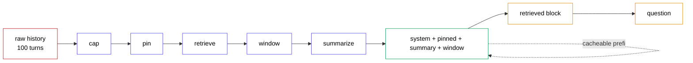

# context-engineering-layer

A composable layer that sits between raw conversation history and the LLM call — cap, pin, retrieve, window, summarise — and the ablation that says which of its parts actually earn their place.

One hundred turns of a PaySetu incident session, twenty-seven planted facts, a 900-token budget, and a ladder where every rung adds exactly one mechanism.

> Verified 2026-08-28 — groq 1.7.0, tiktoken 0.14.0, rank-bm25 0.2.2, numpy 2.5.2, Python 3.12, Windows. Models `openai/gpt-oss-120b` and `openai/gpt-oss-20b`, both production and absent from Groq's deprecation schedule at any date.

---

## The catch this project is built around

**Your agent does not die at the model's 131,072-token context window. It dies at 8,000 tokens per minute.**

```
The same agent at turn 100, unlayered
  assembled 16,319 tok
  oversized: 16,319 prompt + 256 completion exceeds the 8,000 TPM bucket
             - rejected, not queued
```

Sixteen thousand tokens is thirteen percent of the context window. It still cannot run, because a request larger than the per-minute bucket is refused outright rather than queued. Every budget number in this project is derived from that wall.

And the fix everyone reaches for makes a second problem worse. Prefix-caching providers bill you for changing the *front* of your prompt. Raw history is append-only, so each turn extends a prefix that was already sent. A sliding window evicts its oldest turn, so byte 400 changes and everything after it is recomputed. Replayed offline against an ideal prefix cache over sixty turns:

| design | billable tokens |
|---|---|
| raw history | 32,831 |
| **sliding window** | **41,837** |
| full pipeline | 32,188 |

The naive fix is the most expensive design on the board — 27% more than sending everything — and it dies anyway once the conversation is long enough.

---

## The five layers

| # | layer | what it does | prefix-stable? | fails how |
|---|---|---|---|---|
| 1 | `cap` | Shortens an over-long message head+tail with an elision marker. A pure function of the message — no budget, no position. | **yes** | Destroys any JSON whose payload sits in the middle, which is most real tool output |
| 2 | `pin` | System prompt plus a small never-evictable facts block, costed off the top. | **yes** | Only holds what you knew to pin in advance |
| 3 | `retrieve` | BM25 over the turns the window is about to drop; re-injects the top-k **uncapped** as a suffix. | prefix yes, block no | Cannot resolve a pronoun, and cannot find paraphrased prose at all — see below |
| 4 | `window` | Keeps the most recent turns that fit. | **no** | Every eviction rewrites the prefix and forfeits the cache |
| 5 | `summarize` | Folds the dropped middle into a running summary. | **no**, amortised | Rewrites the front of the prompt outright |

`cap` being a pure function of the message is what makes it prefix-stable: a message renders byte-identically on turn 100 as it did on turn 4. Any cap that adapted to remaining budget would rewrite history every turn.

`retrieve` re-injects the **uncapped** original. Handing back a turn whose middle `cap` had already elided would make retrieval structurally unable to recover the 40% of facts living in that middle — and the ceiling would read as a retrieval-quality result when it was an ordering bug.



Everything up to the retrieved block is a stable prefix. Only the block and the question vary per query — which is why retrieval is appended as a suffix rather than dropped into chronological position.

---

## Pre-registered criterion

Declared in `src/report.py` before the grading run.

> Retrieval and summarisation earn their place iff, at the same 900-token budget, the full pipeline beats `cap+pin+window` by at least 20 points on the out-of-window needles, with exact-McNemar p < 0.01.

**Result: MET.** `full` 9/23 (39%, 95% CI [22%, 61%]) against `pin` 1/23 (4%) — a 35-point gain, discordant 8:0, exact McNemar p = 0.008.

At n=23 a single probe is 4.3 points. The interval is wide and only a gap this large is resolvable; the middle of the ladder is not separable and this report does not pretend otherwise.

The baseline is deliberately **not** the naive window. The naive window's reach is what *defines* the recent zone, so the out-of-window probes sit outside it by construction and beating it there would prove nothing. `cap+pin+window` is a real alternative somebody would ship.

---

## Measured results

Read the second table before the first.

### The ladder

| arm | what it adds | out-of-window recall | recent | turns held | assembled tok |
| --- | --- | ---: | ---: | ---: | ---: |
| none | null context | 0/23 (0%) | 0/4 | 0 | 129 |
| raw | raw history | — *oversized* | — | 100 | 16,319 |
| window | + window | 0/23 (0%) | 4/4 | 4 | 772 |
| pin | + pin | 1/23 (4%) | 4/4 | 7 | 781 |
| **full** | + retrieve | **9/23 (39%)** | 4/4 | 5 | 895 |

Capping nearly doubles how many turns fit the same budget — 4 raw turns become 7 capped ones. The full stack then spends some of that back on a summary and a retrieved block, holding only 5 turns, and still recalls far more. Reach and recall are not the same axis.

### Did the layer fail, or the model?

| arm | present & correct | present & missed | absent & missed | absent & correct |
| --- | ---: | ---: | ---: | ---: |
| none | 0 | 0 | 23 | 0 |
| window | 0 | 0 | 23 | 0 |
| pin | 1 | 0 | 22 | 0 |
| full | 9 | **1** | 13 | 0 |

`absent & missed` is the layer failing to carry the fact. `present & missed` is the model failing to read one it was given. A recall number alone cannot tell those apart, and they need opposite fixes.

The whole `window` column is layer failure — it never had the fact. `full` is the only arm that gets facts into the prompt at all, and when it does it reads them 9 times out of 10.

### What the run found that the design did not predict

| arm | recall when the fact was in prose | when it was in tool output |
| --- | ---: | ---: |
| window | 0/8 | 0/15 |
| pin | 0/8 | 1/15 |
| **full** | **0/8** | **9/15 (60%)** |

BM25 matches tokens. A value in a JSON field with a distinctive name is findable; the same value paraphrased into a sentence is invisible. The build gate that forces low lexical overlap between a probe and the transcript — the gate that stops the retrieval test being rigged — is exactly what makes prose unretrievable by a lexical retriever.

Six out of six deep facts the layer recovered were tool-carried. All eight prose facts failed. That is the argument for embeddings, and it is a measurement rather than an opinion.

### Validity gates

Checked before the verdict. Any failure voids the run.

| check | result |
| --- | --- |
| no contamination | pass — 0 rows correct from a context the fact was absent from |
| recent zone is a clean sweep | pass — every arm answers every fact inside its own window |
| null context scores zero | pass — no planted fact is guessable without the conversation |
| no-pin control fails the pinned probe | pass — the pinned block really is removed when pin is off |
| truncation under ceiling | pass — 0.0% |

Zero hallucinations: every arm answered `UNKNOWN` to both never-planted probes.

---

## What the pre-flight measured, and why it changed the plan

Groq's docs say cached tokens do not count toward rate limits. Measured on this account, they do — and the cache barely engages in the first place.

Twelve back-to-back calls sharing a byte-identical 1,289-token prefix inside 50 seconds produced **one cache hit in ten**. On the single call that did hit — 1,280 of 1,289 tokens served from cache, 99% — refill-corrected spend against `x-ratelimit-remaining-tokens` was **1,359 tokens**, against 1,318 predicted if charged in full and 29 if exempt. The hit bought the price discount and no rate-limit relief.

So a "warm" probe costs a full prefix, not a marginal question. The full eight-arm profile would need 3.3 days rather than one, and the pre-registered fallback fired: `--profile lite` today, the two interior rungs and the model swap on the next refill. The replay cache makes adding them free.

This also inverts the cost story in practice. Over ten live turns:

```
raw history      11,410 billable tokens
with the layer    6,998 billable tokens   (39% less)
```

The opposite of what an ideal prefix cache predicts. Prefix stability only pays when the provider's cache actually fires — and here it mostly did not, so bounding the context wins on cost as well as on survival.

`PYTHONPATH=. uv run python -m src.main cache-probe` re-measures this on your own account. Do not trust the numbers above without it.

---

## Use this in your own agent

The experiment exists to test the layer, not the other way round. `src/layers/*`, `context.py`, `tokens.py`, `types.py` and `pipeline.py` import nothing from `config.py`, so they lift out cleanly.

```python
from src.pipeline import build_messages
from src.types import Message

messages = await build_messages(
    history,                       # list[Message], your agent's message log
    budget=3000,                   # tokens the assembled context may occupy
    query="what did we decide about the retry policy?",
    system=SYSTEM_PROMPT,
    pinned=["customer is on the Growth plan"],
    summarize_fn=my_summariser,    # optional; omit and the layer skips summarising
)
```

Copy `src/layers/`, `src/context.py`, `src/tokens.py`, `src/types.py`, `src/pipeline.py`. Nothing else.

**The knob that matters** is `cap_max_message_tokens` in `PipelineConfig`. It is set to 35 here because a turn in this transcript is 140 tokens. Your tool outputs are not 300 tokens, and capping is where almost all of the benefit comes from — measure yours before copying the number.

---

## Setup

```bash
uv init context-engineering-layer
uv add "groq>=1.7.0" "tiktoken>=0.14.0" "rank-bm25>=0.2.2" "numpy>=2.5.2" \
       "python-dotenv>=1.2.3" "rich>=15.0.0" "matplotlib>=3.11.1"
```

`.env`:

```
GROQ_API_KEY=gsk_...        # free key: https://console.groq.com/keys
TOKENIZER_FUDGE=1.07        # what cache-probe measured; re-measure on your account
```

---

## Run it

Start with the two that cost nothing. Both rebuild every table and figure from the committed results file.

```bash
PYTHONPATH=. uv run python -m src.report      # the whole scorecard, 0 tokens
PYTHONPATH=. uv run python -m src.plot        # both figures, 0 tokens
PYTHONPATH=. uv run python -m src.scenario    # transcript, zones, build gates, 0 tokens
```

Then the one that makes the point in ten seconds:

```bash
PYTHONPATH=. uv run python -m src.main ask "Which partition ended up carrying the blame?" --turn 100
```

Unlayered, that request is refused before it reaches the model. Layered, it answers `shard-19` from a turn eighty-two exchanges back.

Then the expensive parts:

```bash
PYTHONPATH=. uv run python -m src.main cache-probe          # measure YOUR cache first
PYTHONPATH=. uv run python -m src.main summary              # freeze + gate the summary
PYTHONPATH=. uv run python -m src.main run --profile smoke  # ~42k tokens
PYTHONPATH=. uv run python -m src.main run --profile lite --yes   # ~106k tokens
PYTHONPATH=. uv run python -m src.main chat --turns 10      # the live break
```

`run` prices the whole run against a local ledger and refuses to start without the headroom. Nothing already cached is ever re-spent.

### Module smoke tests

```bash
PYTHONPATH=. uv run python -m src.config      # resolved settings + the TPM arithmetic
PYTHONPATH=. uv run python -m src.tokens      # capping, budget splits, prefix sharing
PYTHONPATH=. uv run python -m src.cache       # replay round trip + the ledger
PYTHONPATH=. uv run python -m src.grader      # substring, formatting and status-ladder traps
PYTHONPATH=. uv run python -m src.ladder      # asserts every rung is a one-switch change
PYTHONPATH=. uv run python -m src.pipeline    # all five layers, budget respected
PYTHONPATH=. uv run python -m src.stats       # bootstrap CI + exact McNemar
```

---

## If your number differs

| you changed | expect | diagnostic |
|---|---|---|
| Bigger tool outputs | Capping matters **more** | If `cap` buys you nothing, your turns are already short and this layer is not your problem |
| Bigger budget | Every arm converges upward | Past ~4× the transcript there is nothing to compress and the ladder flattens |
| Facts in prose, not JSON | Retrieval collapses | BM25 is lexical. This is the 0/8 column |
| A paid tier | The break moves, the cost story stays | Higher TPM pushes the wall out; prefix rewriting still costs what it costs |
| `gpt-oss-20b` | Unmeasured here | The model swap is the next day's run — see below |

---

## Where this would fail

- **BM25 cannot resolve a pronoun.** "What was that number again?" retrieves nothing. The 0/8 prose column is the same failure in another form.
- **`cap` destroys JSON whose payload sits in the middle**, which is most real tool output. Head-and-tail truncation is the wrong cap; a schema-aware one that preserves keys and truncates values is right, and is not built here.
- **One transcript.** Every number is n=1 in *scenario*, not just in items. A second seed is the cheapest way to find out how much of this is one conversation's shape.
- **The turn is the retrieval unit**, which is false for a 3,000-token tool result. Real chunking would retrieve the field, not the exchange.
- **The model swap did not run.** Whether this ladder's ordering is a property of the layer or of `gpt-oss-120b` is exactly the question `guardrails-layer` answered with a swap, and it is unanswered here.
- **`raw` never produced a recall number**, because it cannot run at this transcript length. There is no full-history ceiling to read the 39% against.

---

## Files

| file | what it does |
| --- | --- |
| `src/config.py` | Every constant that moves a number, with the arithmetic behind it |
| `src/types.py` | Message, Turn, Fact, Usage, ProbeResult, and the status set |
| `src/tokens.py` | Counting, head+tail elision, budget splitting, prefix sharing |
| `src/cache.py` | sqlite replay cache and the local daily-token ledger |
| `src/llm.py` | The only module that spends money. Never raises |
| `src/preflight.py` | Measures whether cached tokens are rate-limit exempt on your account |
| `src/context.py` | The immutable carrier, and the block render order that is the cache design |
| `src/layers/` | `base` `cap` `pin` `retrieve` `window` `summarize` — one `apply` each |
| `src/pipeline.py` | Chains the layers; exposes `build_messages` |
| `src/ladder.py` | The arms, and the import-time assert that each is a one-switch change |
| `src/scenario.py` | Expands the spec into 100 turns; derives the zones; runs the build gates |
| `src/summarizer.py` | The frozen running summary and its leakage gate |
| `src/grader.py` | Answer-span extraction, normalisers, the status precedence ladder |
| `src/probes.py` | Assemble → grep for the fact → call → grade |
| `src/harness.py` | Runs the ladder, prices it first, writes the results |
| `src/report.py` | The criterion, the validity gates, the tables, `leaderboard.md` |
| `src/plot.py` | Both figures, offline |
| `src/chat.py` | `ask` and the live break demo |
| `data/scenario.json` | One line per fact. Everything else is generated from it |

---

## What to build next

- **Embeddings instead of BM25.** The 0/8 prose column is the whole argument.
- **The model swap.** Re-run arms `window`, `pin`, `full` on `gpt-oss-20b` and find out whether the ordering is a property of the layer or of the model.
- **A budget sweep** across 700 / 900 / 3,000 to find the crossover where retrieval starts earning its place. A point result at one budget does not port to yours.
- **Schema-aware capping** — preserve JSON keys, truncate values, keep the first array element plus a count.
- **A second transcript seed**, so the numbers stop being n=1 in scenario.
