# hardened-rag — architecture diagram

Paste the block below into any Mermaid renderer. Landscape, white fill,
coloured outlines, black text.

```mermaid
flowchart LR
    Q[Question] --> R[Dense retrieval top 20]
    R --> RR[Cross-encoder rerank to top 5]
    RR --> S{Two screens}
    S -->|injection score| D[Quarantine]
    S -->|question echo| D
    S --> I[Read each passage alone]
    I --> C[Claim table verified against passage text]
    C --> P[Resolve by source tier and date]
    P --> A[Answer with a citation, or abstain]

    style Q fill:#ffffff,stroke:#4f46e5,color:#000000
    style R fill:#ffffff,stroke:#4f46e5,color:#000000
    style RR fill:#ffffff,stroke:#4f46e5,color:#000000
    style S fill:#ffffff,stroke:#d97706,color:#000000
    style D fill:#ffffff,stroke:#dc2626,color:#000000
    style I fill:#ffffff,stroke:#0891b2,color:#000000
    style C fill:#ffffff,stroke:#0891b2,color:#000000
    style P fill:#ffffff,stroke:#059669,color:#000000
    style A fill:#ffffff,stroke:#059669,color:#000000
```

The one thing the diagram has to carry: everything left of "Read each passage
alone" is about which text reaches the model, and everything right of it is
about a decision the model is not allowed to make. The tier and the date live
only in the last two nodes, and never enter a prompt.
