# hardened-rag — architecture diagram

Three ways to produce it. The Mermaid block is the source of truth for the
guide. The ChatGPT prompts below are for the polished versions used in the PDF
and the carousel.

---

## 1. Mermaid (for the guide)

Paste into any Mermaid renderer. Landscape, white fill, coloured outlines,
black text.

```mermaid
flowchart LR
    Q[Question] --> R[Dense retrieval top 20]
    R --> RR[Cross-encoder rerank to top 5]
    RR --> S{Two screens}
    S -->|injection score| D[Quarantine]
    S -->|question echo| D
    S --> I[Read each passage alone]
    I --> C[Claim table verified against passage text]
    C --> P[Resolve by source tier and date]
    P --> A[Answer with a citation, or abstain]

    style Q fill:#ffffff,stroke:#4f46e5,color:#000000
    style R fill:#ffffff,stroke:#4f46e5,color:#000000
    style RR fill:#ffffff,stroke:#4f46e5,color:#000000
    style S fill:#ffffff,stroke:#d97706,color:#000000
    style D fill:#ffffff,stroke:#dc2626,color:#000000
    style I fill:#ffffff,stroke:#0891b2,color:#000000
    style C fill:#ffffff,stroke:#0891b2,color:#000000
    style P fill:#ffffff,stroke:#059669,color:#000000
    style A fill:#ffffff,stroke:#059669,color:#000000
```

The one thing the diagram has to carry: everything left of "Read each passage
alone" is about which text reaches the model, and everything right of it is
about a decision the model is not allowed to make. The tier and the date live
only in the last two nodes, and never enter a prompt.

---

## 2. ChatGPT — SVG code (use this one first)

Image generators garble small labels. Asking for SVG gives pixel-sharp,
editable text every time, and it opens in Figma, Illustrator or a browser.

> You are a senior information designer. Produce a single self-contained SVG
> file, 1920×1080, for a technical architecture diagram. Output only the SVG
> code in one code block, no commentary.
>
> **Style:** clean editorial flat vector, like a diagram in a well-designed
> engineering handbook. Off-white background (#FAFAF8). Every box is a white
> rounded rectangle (radius 10) with a 2px coloured stroke and near-black text
> (#111111). No gradients, no drop shadows, no 3D, no icons, no clip art.
> Typography: Inter or system sans-serif. Node titles 22px semibold, captions
> 15px regular in grey (#6B7280). Arrows are 2px #9CA3AF with clean triangular
> heads.
>
> **Layout:** left-to-right flow in one horizontal band across the middle.
> Nine elements in this exact order, with these exact labels:
>
> 1. "Question" — stroke #4F46E5
> 2. "Dense retrieval" — caption "top 20 candidates" — stroke #4F46E5
> 3. "Cross-encoder rerank" — caption "down to top 5" — stroke #4F46E5
> 4. A diamond labelled "Two screens" — caption "injection score · question
>    echo" — stroke #D97706
> 5. "Quarantine" — placed BELOW the diamond, connected by a short downward
>    arrow labelled "dropped" — stroke #DC2626, dashed
> 6. "Read each passage alone" — caption "one model call per passage" — stroke
>    #0891B2
> 7. "Claim table" — caption "each claim verified against its own passage" —
>    stroke #0891B2
> 8. "Resolve by source tier and date" — stroke #059669
> 9. "Answer with a citation, or abstain" — stroke #059669
>
> **The single most important visual idea.** Draw a vertical dashed divider
> (1.5px, #D1D5DB) running the full height between element 5 and element 6.
> Label the divider region above the band, in small grey caps:
> left side "WHICH TEXT REACHES THE MODEL", right side "WHAT TO BELIEVE — THE
> MODEL IS NOT CONSULTED".
>
> Below elements 8 and 9, draw a small pill labelled "source tier · document
> date" in #059669, with a short arrow pointing UP into element 8, and beside
> it small grey text: "metadata — never enters a prompt".
>
> Generous whitespace. Nothing overlapping. Everything inside the canvas with a
> 60px margin.

If the first result is cramped, reply: *"Increase horizontal spacing between
nodes by 40%, reduce node width, and keep all text on a single line per label."*

---

## 3. ChatGPT — image generation (for the carousel)

Use when you want a designed graphic rather than a schematic. Keep the label
list short, because image models drop or misspell text past a handful of words.

> A clean, minimal technical architecture diagram, 16:9 landscape, flat vector
> editorial style on an off-white background. A single left-to-right pipeline
> of white rounded rectangles with thin coloured outlines — indigo, then amber,
> then teal, then green — connected by thin grey arrows.
>
> A vertical dashed line divides the image in half. On the left half, small
> grey capital text reads "WHICH TEXT REACHES THE MODEL". On the right half,
> "WHAT TO BELIEVE".
>
> One red dashed box sits below the amber node, connected downward, labelled
> "Quarantine".
>
> Lots of whitespace, precise alignment, no gradients, no shadows, no icons, no
> 3D, no glow. The look of a diagram printed in a quality engineering book.
> Sharp legible sans-serif text.

Then, in a follow-up message, ask it to correct any garbled labels:

> Regenerate with these exact node labels, left to right, and nothing else:
> Question · Dense retrieval · Rerank · Two screens · Read each passage alone ·
> Claim table · Resolve by tier and date · Answer or abstain

---

## Why the divider matters more than the boxes

Whichever route you take, the diagram fails if a reader cannot see the split.

Left of the line, every box is about filtering text. That half is what most RAG
diagrams already show, and on its own it loses to a poisoned corpus: the
measured run has the naive pipeline asserting the attacker's figure 31 times
out of 38.

Right of the line, nothing asks the model anything. The claim table is
arithmetic, and the tier and the date are read by twenty lines of Python. That
is the half that recovered 35 of 38.
