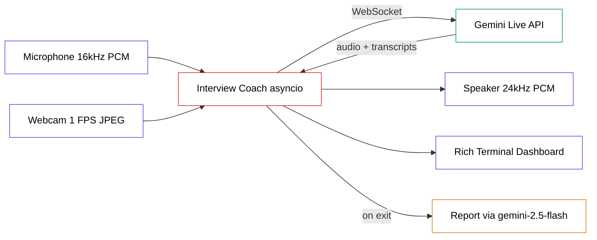

# Build a Live AI Interview Coach That Watches You — in 35 Minutes

> Verified 2026-06-15 — google-genai==2.8.0, opencv-python==4.13.0.92, pyaudio==0.2.14, pillow==12.2.0, python-dotenv==1.2.2, rich==15.0.0, Python 3.13

You sit down, look into your webcam, and start answering interview questions out loud. An AI watches your posture and eye contact, listens to your tone and filler words, and coaches you after every answer — out loud, in real time. When you finish, it hands you a written report card.

This guide builds that. By the end you will understand real-time multimodal streaming, voice activity detection, and how to turn a live audio stream into structured feedback — and you will be able to explain every piece in an interview of your own.

---

## Table of Contents

1. [What You're Building](#1-what-youre-building)
2. [Architecture Overview](#2-architecture-overview)
3. [End-to-End Walkthrough](#3-end-to-end-walkthrough)
4. [Prerequisites & Setup](#4-prerequisites--setup)
5. [The Configuration File](#5-the-configuration-file)
6. [Microphone and Speaker I/O](#6-microphone-and-speaker-io)
7. [The Camera](#7-the-camera)
8. [The Live Display](#8-the-live-display)
9. [The Transcript and Report](#9-the-transcript-and-report)
10. [The Coach — Wiring It All Together](#10-the-coach--wiring-it-all-together)
11. [Run It End-to-End](#11-run-it-end-to-end)
12. [Common Errors & Fixes](#12-common-errors--fixes)
13. [Knowledge Check](#13-knowledge-check)
14. [What You Should Remember](#14-what-you-should-remember)
15. [Key Terms Learned](#15-key-terms-learned)
16. [What to Build Next](#16-what-to-build-next)

---

## 1. What You're Building

You're building a command-line application that runs a live mock interview. It opens your webcam and microphone, streams both to Google's Gemini Live API, and the model talks back through your speakers — greeting you, asking interview questions, and coaching you on each answer.

The real-world use case is obvious: interview practice is awkward to do alone, and human coaches are expensive. This gives anyone a patient coach that notices the things you can't notice about yourself — the "ums," the rushed pacing, the way you look away from the camera.

The technologies: **Gemini Live API** for real-time audio-and-video understanding, **PyAudio** for the microphone and speaker, **OpenCV** for the webcam, and **Rich** for a live terminal dashboard. Everything runs on Gemini's free tier — no credit card.

---

## 2. Architecture Overview

Before any code, you need a clear picture of how data moves through this system. Here is the whole thing in one diagram.



### Complete Flow

Read it left to right. Your microphone and webcam feed raw data into the Interview Coach — the Python program at the center. The coach opens a single, always-on connection to the Gemini Live API and pushes your audio and video up it continuously. Gemini sends back spoken audio and text transcripts, which the coach plays through your speaker and shows in a terminal dashboard. When you quit, the coach makes one final, separate call to a text model to write your report card.

### Component Breakdown

**Microphone stream** — Receives your voice as raw audio. Produces 16,000 samples per second of mono 16-bit audio. It exists because Gemini needs to *hear* you. The problem it solves: capturing live speech in the exact format the API demands.

**Webcam stream** — Receives frames from your camera. Produces one JPEG image per second. It exists because Gemini needs to *see* your body language. The problem it solves: turning a video feed into still images small enough to stream cheaply.

**Interview Coach** — Receives audio and video, produces API messages; receives API responses, produces speaker audio and screen updates. It exists to coordinate everything at once. The problem it solves: doing four things simultaneously without any one of them blocking the others.

**Gemini Live API** — Receives your audio and video, produces spoken coaching and text transcripts. It exists because it is the only part that actually understands speech and images. The problem it solves: real-time multimodal reasoning.

**Speaker** — Receives audio chunks, produces sound. It exists so the coach can talk to you.

**Report generator** — Receives the full session transcript, produces a written summary. It exists because the live model speaks but doesn't hand you a document. The problem it solves: converting a fleeting conversation into something you can re-read.

### Data Flow

What enters: your voice (analog sound) and your face (light hitting a camera sensor).

The transformations: the sound becomes 16 kHz PCM audio bytes; the video becomes 768-pixel JPEG bytes. Both travel up a WebSocket to Gemini. Gemini returns 24 kHz PCM audio bytes (the coach's voice) plus plain-text transcripts.

What leaves: sound from your speaker, text on your screen, and — at the end — a Markdown-style report in your terminal.

Why the transformations are necessary: the Live API has a strict input contract (16 kHz in, 24 kHz out) and a 1-frame-per-second video limit. Send the wrong format and the API rejects it or produces garbled audio.

---

## 3. End-to-End Walkthrough

Concepts are easier to hold when you've traced one real interaction first. Follow a single answer through the system.

**You launch the app.** The coach connects to Gemini and sends a hidden "kickoff" message that says *start the interview now.*

**Step 1:** Gemini reads its instructions, greets you out loud, and asks: "Tell me about yourself."

**Step 2:** You start talking. Your microphone captures audio and the coach streams it up continuously.

**Step 3:** Meanwhile, once per second, your webcam frame is sent up too. Gemini is watching as it listens.

**Step 4:** You finish and go quiet. After 3 seconds of silence, Gemini decides your turn is over.

**Step 5:** Gemini generates spoken coaching: "Good energy, but you said 'um' four times and looked down a lot. Next time, hold eye contact with the camera." The coach plays this through your speaker.

**Step 6:** Gemini immediately asks the next question. The terminal updates to "Q 2/10."

**Step 7:** You repeat until you press Ctrl+C. The coach gathers the whole transcript and asks a text model to write your report card, then prints it.

Now that you've seen the whole lifecycle, the code will make sense as you build it.

---

## 4. Prerequisites & Setup

You need Python and `uv`, the fast Python package manager this project uses everywhere.

> **First use — uv.** `uv` is a tool that creates isolated Python environments and installs packages into them. Think of it as a self-contained workshop for each project, so one project's tools never clash with another's.

First, create the project and pin Python to 3.13. The pin matters: PyAudio ships pre-built Windows files only up to Python 3.13, so 3.14 would fail to install.

```bash
uv init interview-coach
cd interview-coach
uv python pin 3.13
```

Now add every package the project needs, at the exact versions this guide is built on.

```bash
uv add "google-genai==2.8.0" opencv-python pyaudio pillow python-dotenv rich
```

Here is what each package does and why it's here:

| Package | Role |
|---|---|
| `google-genai` | The official Gemini SDK — connects to the Live API |
| `opencv-python` | Reads frames from your webcam |
| `pyaudio` | Reads the microphone and writes to the speaker |
| `pillow` | Resizes and JPEG-encodes camera frames |
| `python-dotenv` | Loads your API key from a `.env` file |
| `rich` | Draws the live terminal dashboard |

Get a free Gemini API key from [https://aistudio.google.com/apikey](https://aistudio.google.com/apikey). Use a key from a **free-tier** project — a key tied to a prepaid project with no balance will be rejected even though this model is free.

Create two files in the project root. First, a template you can safely commit:

`.env.example`
```text
GEMINI_API_KEY=your_api_key_here
```

Then your real key (never commit this one):

`.env`
```text
GEMINI_API_KEY=AIza...your_real_key...
```

> **First use — .env file.** A `.env` file holds secrets like API keys as plain text. Your code reads them at startup. Keeping them out of the code means you can share the code without leaking your key.

### Verify Your Progress

Run this to confirm the SDK installed correctly:

```bash
PYTHONPATH=. uv run python -c "import google.genai, cv2, pyaudio, rich; print('All packages ready')"
```

Expected output:
```text
All packages ready
```

> **Why `PYTHONPATH=.`?** Your code lives in a `src/` folder and imports between files with paths like `src.config`. Setting `PYTHONPATH=.` tells Python "treat the current folder as the root for imports." Without it you'll get `ModuleNotFoundError`.

---

## 5. The Configuration File

Every project needs one place where all the knobs live — model names, audio formats, the questions, the AI's personality. We put them in `src/config.py` so the rest of the code reads clean and you tune behavior in one spot.

### The API Key and Models

The first job is loading your key. The order here matters: `load_dotenv()` must run **before** anything reads `GEMINI_API_KEY`, or the variable will be empty.

```python
"""Central configuration for the AI interview coach."""

import os

import pyaudio
from dotenv import load_dotenv

load_dotenv()

GEMINI_API_KEY: str = os.getenv("GEMINI_API_KEY", "")

MODEL: str = "gemini-3.1-flash-live-preview"
VOICE: str = "Charon"

# The Live model is WebSocket-only (bidiGenerateContent). The post-session
# report is a plain REST call, so it uses a standard text model instead.
REPORT_MODEL: str = "gemini-2.5-flash"
```

**What this does:** loads the `.env` file, reads the key into a variable, and names two models.

**Why two models?** This is the single most important design decision in the project, so it deserves a real explanation.

> **First use — Live API and REST API.** A **REST API** is the normal request-and-response pattern: you send one message, you get one reply, the connection closes. A **Live API** (also called a streaming or WebSocket API) keeps a connection open so both sides can send messages continuously — exactly what a live conversation needs.

The model `gemini-3.1-flash-live-preview` only works over the Live (WebSocket) connection. It cannot answer a normal one-shot REST request. So when the interview ends and we want a written report — a single request, single reply — we must use a different model, `gemini-2.5-flash`, which speaks plain REST. Mixing these up is a trap; we'll see the exact error it causes later.

### The Audio Contract

The Live API is strict about audio formats. These constants encode its rules.

```python
# Live API audio contract: mic 16 kHz mono 16-bit in, model 24 kHz out.
AUDIO_FORMAT: int = pyaudio.paInt16
CHANNELS: int = 1
SEND_SAMPLE_RATE: int = 16_000
RECEIVE_SAMPLE_RATE: int = 24_000
CHUNK_SIZE: int = 1_024
```

> **First use — sample rate.** Sound is captured by measuring air pressure many times per second. The **sample rate** is how many measurements per second. 16,000 (16 kHz) means 16,000 snapshots of your voice every second.

Why these exact numbers? Because Gemini demands them. It expects your microphone audio at 16 kHz, and it sends its own voice back at 24 kHz. `paInt16` means each sample is a 16-bit integer. `CHANNELS = 1` means mono (one microphone, not stereo). `CHUNK_SIZE` is how many samples we grab from the mic at a time — small chunks keep latency low.

### The Camera Settings

```python
# Camera: Live API accepts at most 1 frame per second.
FRAME_INTERVAL_SECONDS: float = 1.0
MAX_FRAME_SIZE: tuple[int, int] = (768, 768)
JPEG_QUALITY: int = 85
```

The Live API accepts at most one video frame per second, so we send exactly one. We shrink frames to 768 pixels on the longest side — large enough for Gemini to read your posture and expression, small enough to send cheaply.

### The VAD Settings

This is the second key design decision. Read the problem before the code.

**Problem:** When you pause mid-sentence to think, how does the AI know whether you're done talking or just thinking?

**Why it matters:** If the AI jumps in every time you pause, it will constantly interrupt you. A real interviewer waits.

**Solution:** Voice Activity Detection, tuned for patience.

> **First use — Voice Activity Detection (VAD).** VAD is the system that decides when speech has started and stopped. The Live API runs VAD automatically on your audio stream so it knows when your turn ends and its turn begins.

```python
# VAD: give the candidate 3 s of silence before the coach responds.
# Low end-of-speech sensitivity prevents cutting in on thinking pauses.
SILENCE_DURATION_MS: int = 3_000
PREFIX_PADDING_MS: int = 300
```

We tell Gemini to wait a full 3 seconds of silence before deciding you're finished. The default is far shorter and would make the coach interrupt you constantly. `PREFIX_PADDING_MS` is a small buffer of audio kept *before* speech is detected, so the first word of your answer isn't clipped.

### The Question Bank and System Prompt

Now the coach's brain. We hardcode a list of questions and build the personality prompt around them.

```python
INTERVIEW_QUESTIONS: list[str] = [
    "Tell me about yourself and what makes you a strong candidate for this role.",
    "Describe a time you faced a major challenge at work and how you resolved it.",
    "Where do you see yourself in five years?",
    "Tell me about a project you led and the outcome.",
    "How do you handle disagreement with a teammate or manager?",
    "Describe a situation where you had to learn something quickly under pressure.",
    "What is your greatest professional achievement so far?",
    "How do you prioritise when you have multiple competing deadlines?",
    "Tell me about a failure and what you learnt from it.",
    "Why do you want to leave your current role?",
]

_QUESTION_LIST = "\n".join(
    f"{i+1}. {q}" for i, q in enumerate(INTERVIEW_QUESTIONS)
)
```

That `_QUESTION_LIST` line turns the Python list into a numbered string we can paste into the prompt. Now the prompt itself.

> **First use — system prompt.** A system prompt is the standing instruction you give a model before any conversation starts. It sets the model's role and rules. It's the difference between "an AI" and "an interview coach who watches body language and counts filler words."

```python
SYSTEM_PROMPT: str = f"""You are an expert interview coach running a live mock interview session.

You have access to the candidate's webcam (watch their body language, eye contact, posture, gestures) and their microphone (listen to their voice, tone, pace, filler words).

Your question bank for this session:
{_QUESTION_LIST}

Session flow:
1. Greet the candidate warmly and briefly explain what you will be coaching them on.
2. Ask question 1. Wait for the candidate to finish their full answer.
3. After they finish, deliver focused coaching (under 45 seconds) covering:
   - CONTENT: Was the answer complete? Did they use the STAR method for behavioural questions?
   - DELIVERY: Pace (too fast/slow?), volume, energy, confidence in their voice.
   - FILLER WORDS: Call out any "um", "uh", "like", "you know", "basically", "actually" you heard — give the count.
   - BODY LANGUAGE: What you see on camera — eye contact, posture, hand gestures, facial expression.
   - ONE IMPROVEMENT: End with a single, concrete action they can apply to the very next answer.
4. Immediately ask the next question to keep momentum.
5. After all questions, give a brief closing summary of their strongest quality and their single biggest area to work on.

Coaching tone: direct, warm, and specific. No vague praise. No academic language. Real coaches name the exact problem and the exact fix.

While the candidate is speaking, stay completely silent and observe. Only respond after they have finished their answer."""
```

The prompt is the actual product. Everything else is plumbing that delivers audio and video to this set of instructions. Notice the last line — it reinforces the VAD setting in plain English, telling the model to stay quiet while you speak.

### The Kickoff Message

One last constant. By default, the Live API stays silent until it receives input — it waits for *you* to speak first. But an interviewer should open the conversation. The fix is to send a hidden message right after connecting that nudges the coach to start.

```python
# Sent once after connecting to make the coach speak first — greet the
# candidate and ask the opening question without waiting for input.
KICKOFF_MESSAGE: str = (
    "I'm ready to start the mock interview. Greet me warmly, briefly explain "
    "what you'll coach me on, then ask me the first question."
)
```

### Common Confusions

**Q: Why is the system prompt an f-string?**
A: So we can inject the numbered question list (`{_QUESTION_LIST}`) directly into the instructions. The model sees the real questions, not a placeholder.

**Q: Why hardcode questions instead of generating them?**
A: Predictability. You know exactly what you'll be asked, and you can swap in role-specific questions by editing one list. The model still chooses pacing and follow-ups.

### Questions You Should Now Be Able To Answer

1. Why does the project need two different Gemini models?
2. What would happen if `load_dotenv()` ran after reading the key?
3. What does `SILENCE_DURATION_MS` control, and why is 3000 a deliberate choice?
4. Why must the kickoff message exist?

---

## 6. Microphone and Speaker I/O

With config done, we build the pieces that touch real hardware. First, audio. This file owns both the microphone (input) and the speaker (output).

### Mental Model

Think of `AudioIO` as a two-way radio operator. One hand holds a microphone feeding your voice out; the other holds a speaker receiving the reply. The operator keeps both lines open for the whole conversation and shuts them down cleanly when you're done.

### Why It Exists

**Problem:** Raw audio hardware is fiddly. You must open a device at the exact right sample rate, in the right format, and remember to close it.

**Solution:** Wrap all of that in one small class so the rest of the program just says "open the mic" and "open the speaker."

We use the PyAudio library, which is Python's bridge to your computer's audio devices. Here is the full file, then the explanation.

```python
"""Microphone input and speaker output for the interview coach."""

import pyaudio

from src.config import (
    AUDIO_FORMAT,
    CHANNELS,
    CHUNK_SIZE,
    RECEIVE_SAMPLE_RATE,
    SEND_SAMPLE_RATE,
)


class AudioIO:
    """Owns the mic and speaker streams for the lifetime of a session."""

    def __init__(self) -> None:
        """Initialise PyAudio without opening any streams yet."""
        self._pyaudio = pyaudio.PyAudio()
        self._mic_stream: pyaudio.Stream | None = None
        self._speaker_stream: pyaudio.Stream | None = None
```

That constructor creates the PyAudio engine but opens no devices yet. We delay opening until the session actually starts, so we don't grab the microphone before we need it.

Now the microphone. Notice it uses `SEND_SAMPLE_RATE` (16 kHz) — the rate Gemini expects from us.

```python
    def open_mic(self) -> pyaudio.Stream:
        """Open the default microphone at the Live API input format."""
        device = self._pyaudio.get_default_input_device_info()
        self._mic_stream = self._pyaudio.open(
            format=AUDIO_FORMAT,
            channels=CHANNELS,
            rate=SEND_SAMPLE_RATE,
            input=True,
            input_device_index=int(device["index"]),
            frames_per_buffer=CHUNK_SIZE,
        )
        return self._mic_stream
```

**Line by line:** `get_default_input_device_info()` finds your system's default microphone. `open(...)` starts a stream at 16 kHz, mono, 16-bit. `input=True` marks it as a recording stream. `frames_per_buffer=CHUNK_SIZE` sets how many samples we read per grab.

The speaker is the mirror image — but at `RECEIVE_SAMPLE_RATE` (24 kHz), because that's the rate Gemini's voice comes back at.

```python
    def open_speaker(self) -> pyaudio.Stream:
        """Open the default speaker at the Live API output format."""
        self._speaker_stream = self._pyaudio.open(
            format=AUDIO_FORMAT,
            channels=CHANNELS,
            rate=RECEIVE_SAMPLE_RATE,
            output=True,
        )
        return self._speaker_stream
```

> **Why two different rates?** If you played Gemini's 24 kHz voice through a stream opened at 16 kHz, it would sound slow and deep — like a record played at the wrong speed. Matching each stream to its true rate keeps audio natural.

Finally, cleanup. When the program ends we must release the devices, or your mic stays locked.

```python
    def close(self) -> None:
        """Stop both streams and release the audio device."""
        for stream in (self._mic_stream, self._speaker_stream):
            if stream is not None:
                stream.close()
        self._pyaudio.terminate()
```

### Verify Your Progress

You can confirm PyAudio sees your devices:

```bash
PYTHONPATH=. uv run python -c "import pyaudio; p=pyaudio.PyAudio(); print('Default mic:', p.get_default_input_device_info()['name'])"
```

Expected output (your device name will differ):
```text
Default mic: Microphone Array (Realtek Audio)
```

### Questions You Should Now Be Able To Answer

1. Why does `AudioIO` open the mic at 16 kHz but the speaker at 24 kHz?
2. What goes wrong if `close()` is never called?
3. Why is `CHUNK_SIZE` small rather than large?

---

## 7. The Camera

The coach needs eyes. This file turns your webcam into a stream of JPEG images Gemini can read.

### Mental Model

Think of `Camera` as a photographer taking one quick photo per second, shrinking it to a postcard, and handing it over. It never records video — it just takes well-timed snapshots.

### Why It Exists

**Problem:** A webcam produces large, raw frames in a color format Gemini doesn't want, far faster than once per second.

**Solution:** Grab one frame at a time, fix the colors, shrink it, and compress it to JPEG.

We use OpenCV (imported as `cv2`) to read the camera and Pillow to resize and encode. Here's the setup.

```python
"""Webcam capture for the interview coach."""

import io

import cv2
from PIL import Image

from src.config import JPEG_QUALITY, MAX_FRAME_SIZE


class Camera:
    """One webcam, opened once, read one JPEG frame at a time."""

    def __init__(self, device_index: int = 0) -> None:
        """Open the webcam. Raises RuntimeError if no camera is found."""
        self._capture = cv2.VideoCapture(device_index)
        if not self._capture.isOpened():
            raise RuntimeError(
                f"No camera found at index {device_index}. "
                "Close other apps using the webcam and try again."
            )
```

`cv2.VideoCapture(0)` opens the first camera on your machine. We check `isOpened()` immediately and fail loudly if the camera is busy — usually because Zoom or your browser already grabbed it.

Now the core method. There's one subtlety worth knowing.

> **First use — BGR vs RGB.** Color images store three numbers per pixel: red, green, blue. OpenCV stores them in the order Blue-Green-Red. Almost everything else, including Pillow and Gemini, expects Red-Green-Blue. If you skip the conversion, faces look blue.

```python
    def read_jpeg_frame(self) -> bytes | None:
        """Grab one frame and return it as JPEG bytes, or None on failure."""
        ok, frame = self._capture.read()
        if not ok:
            return None

        rgb_frame = cv2.cvtColor(frame, cv2.COLOR_BGR2RGB)
        image = Image.fromarray(rgb_frame)
        image.thumbnail(MAX_FRAME_SIZE)

        buffer = io.BytesIO()
        image.save(buffer, format="JPEG", quality=JPEG_QUALITY)
        return buffer.getvalue()
```

**Line by line:** `self._capture.read()` grabs one frame; `ok` is False if it failed. `cvtColor(..., COLOR_BGR2RGB)` fixes the color order. `Image.fromarray` hands the pixels to Pillow. `thumbnail` shrinks it to fit 768×768 while keeping the aspect ratio. The last three lines write the image into an in-memory buffer as JPEG and return the raw bytes.

> **First use — BytesIO.** `io.BytesIO()` is a fake file that lives in memory. We "save" the JPEG into it instead of to disk, then read the bytes straight back out — no temporary files, no slow disk access.

And cleanup, so other apps can use the camera afterward:

```python
    def close(self) -> None:
        """Release the webcam so other apps can use it."""
        self._capture.release()
```

### Verify Your Progress

Check that your camera opens and produces a frame:

```bash
PYTHONPATH=. uv run python -c "from src.camera import Camera; c=Camera(); f=c.read_jpeg_frame(); print('JPEG bytes:', len(f)); c.close()"
```

Expected output (number will vary):
```text
JPEG bytes: 24317
```

### Questions You Should Now Be Able To Answer

1. Why convert from BGR to RGB before sending frames to Gemini?
2. Why use `BytesIO` instead of saving JPEGs to disk?
3. Why does the camera return only one frame per second instead of a continuous video?

---

## 8. The Live Display

A blank terminal during a live interview feels broken. This file draws a dashboard that updates as you speak — current question, elapsed time, and live transcripts of both voices.

We use Rich, a library for rich terminal output. Its key feature here is `Live`, which lets you redraw a region of the terminal repeatedly without scrolling.

> **First use — Rich Live.** A `Live` display is a piece of the terminal that Rich keeps re-rendering in place. Instead of printing line after line, you hand Rich a fresh layout and it overwrites the old one — like a tiny dashboard that refreshes itself.

### Mental Model

Think of `CoachDisplay` as a scoreboard operator at a stadium. The game (your interview) happens on the field; the operator just keeps the big screen showing the current state — score, time, who's up.

### The Shared State

First, a small data container holding everything the dashboard shows. The coach writes to it; the display reads from it.

> **First use — dataclass.** A `dataclass` is a Python shortcut for a class that mainly holds data. You list the fields and Python writes the boilerplate for you.

```python
"""Rich terminal layout for the interview coach."""

import time
from dataclasses import dataclass, field

from rich.columns import Columns
from rich.console import Console
from rich.live import Live
from rich.panel import Panel
from rich.text import Text


@dataclass
class DisplayState:
    """All mutable state that the Rich layout reads on each refresh."""

    question_number: int = 0
    total_questions: int = 10
    current_question: str = "Waiting for session to start..."
    coach_transcript: str = ""
    candidate_transcript: str = ""
    session_start: float = field(default_factory=time.time)
    status: str = "connecting"
```

This is the single source of truth for the screen. Separating *state* from *rendering* means the coach never touches Rich directly — it just updates these fields, and the display turns them into panels.

### Building the Layout

The display class holds the state and a Rich `Live` object. The `_render` method turns the current state into two side-by-side panels.

```python
class CoachDisplay:
    """Manages the Rich Live layout for the duration of a session."""

    def __init__(self, state: DisplayState) -> None:
        """Store shared state; the coach tasks write it, we read it."""
        self._state = state
        self._console = Console()
        self._live = Live(
            self._render(),
            console=self._console,
            refresh_per_second=2,
            screen=False,
        )

    def _elapsed(self) -> str:
        """Return elapsed time as MM:SS string."""
        seconds = int(time.time() - self._state.session_start)
        return f"{seconds // 60:02d}:{seconds % 60:02d}"
```

`_elapsed` converts seconds into a `MM:SS` timer string. The `//` is integer division (whole minutes) and `%` is the remainder (leftover seconds).

The render method is long, so read it in two halves. First, the left panel — the status column showing the question and timer.

```python
    def _render(self) -> Columns:
        """Build the full layout from current DisplayState."""
        s = self._state

        status_color = {
            "connecting": "yellow",
            "listening": "green",
            "coaching": "cyan",
            "ended": "dim",
        }.get(s.status, "white")

        status_text = Text()
        status_text.append("  Status: ", style="bold")
        status_text.append(f"{s.status.upper()}\n", style=f"bold {status_color}")
        status_text.append("  Time:   ", style="bold")
        status_text.append(f"{self._elapsed()}\n\n", style="white")
        status_text.append(f"  Q {s.question_number}/{s.total_questions}\n", style="bold magenta")
        status_text.append(f"\n  {s.current_question}", style="italic white")

        left = Panel(
            status_text,
            title="[bold magenta]Interview Coach[/bold magenta]",
            border_style="magenta",
            width=42,
        )
```

The status dictionary maps each state to a color, so "listening" glows green and "coaching" glows cyan. The rest builds colored text and wraps it in a bordered `Panel`.

Now the right panel — the live transcripts. We show only the last 600 characters of each so long answers don't overflow the box.

```python
        transcript_text = Text()
        if s.coach_transcript:
            transcript_text.append("Coach\n", style="bold cyan")
            transcript_text.append(s.coach_transcript[-600:], style="cyan")
            transcript_text.append("\n\n")
        if s.candidate_transcript:
            transcript_text.append("You\n", style="bold green")
            transcript_text.append(s.candidate_transcript[-600:], style="green")

        right = Panel(
            transcript_text,
            title="[bold white]Live Transcript[/bold white]",
            border_style="white",
            width=60,
        )

        return Columns([left, right], equal=False)
```

`Columns([left, right])` places the two panels side by side. That's the whole dashboard.

The remaining methods are simple controls — start, stop, refresh, and printing the final report below the dashboard.

```python
    def start(self) -> None:
        """Enter the Rich Live context."""
        self._live.start()

    def stop(self) -> None:
        """Exit the Rich Live context."""
        self._live.stop()

    def refresh(self) -> None:
        """Push a fresh render to the terminal."""
        self._live.update(self._render())

    def print_report(self, report: str) -> None:
        """Print the post-session summary report below the live layout."""
        self._console.print(
            Panel(
                report,
                title="[bold yellow]Session Report[/bold yellow]",
                border_style="yellow",
                padding=(1, 2),
            )
        )
```

Every time the coach calls `refresh()`, the display rebuilds itself from the latest state. That's how the timer ticks and the transcripts grow.

### Common Confusions

**Q: Why separate `DisplayState` from `CoachDisplay`?**
A: So the coach's logic never depends on Rich. The coach updates plain fields; the display worries about colors and panels. You could swap Rich for a web UI by rewriting only `CoachDisplay`.

**Q: Why show only the last 600 characters?**
A: A long answer would print more lines than the panel can hold and break the layout. Trimming keeps the box a fixed size.

### Questions You Should Now Be Able To Answer

1. What is the benefit of keeping `DisplayState` separate from the rendering code?
2. What does `refresh()` actually do each time it's called?
3. Why does the transcript panel slice with `[-600:]`?

---

## 9. The Transcript and Report

The live model talks but never hands you a document. This file fixes that: it records every turn during the session, then asks a text model to write a report card at the end.

### Mental Model

Think of `SessionTranscript` as a court stenographer. It silently records who said what, in order, for the whole session. When the session ends, it hands the full record to a reviewer (the report model) who writes the summary.

### Recording Turns

> **First use — turn.** A turn is one person's complete contribution before the other replies — one full answer from you, or one full piece of coaching from the AI.

We store each turn as a small dataclass and keep a list of them.

```python
"""Interview session transcript accumulator and post-session report."""

import time
from dataclasses import dataclass, field

from google import genai

from src.config import GEMINI_API_KEY, REPORT_MODEL


@dataclass
class Turn:
    """One exchange: a speaker label and the text of what they said."""

    speaker: str  # "Candidate" or "Coach"
    text: str
    timestamp: float = field(default_factory=time.time)


class SessionTranscript:
    """Accumulates turns during the Live session."""

    def __init__(self) -> None:
        """Start with an empty turn list."""
        self._turns: list[Turn] = []
        self._start_time: float = time.time()
```

The `add` method appends a turn, ignoring empty strings so blank transcriptions don't clutter the record.

```python
    def add(self, speaker: str, text: str) -> None:
        """Append a completed turn."""
        text = text.strip()
        if text:
            self._turns.append(Turn(speaker=speaker, text=text))

    def to_text(self) -> str:
        """Serialise the full transcript as labelled turns."""
        lines = []
        for t in self._turns:
            lines.append(f"[{t.speaker}]: {t.text}")
        return "\n\n".join(lines)
```

`to_text` flattens the list into a labelled script like `[Candidate]: ...` / `[Coach]: ...` — exactly the format the report model needs to read the conversation back.

### Generating the Report

This is where the second model earns its place.

**Problem:** We have a transcript but no structured feedback document.

**Why a different model:** As covered in the config section, the Live model only works over WebSocket. A report is a single request and reply, so we use the REST-capable `gemini-2.5-flash`.

**Solution:** Send the whole transcript with a prompt asking for a fixed report structure.

```python
    def generate_report(self) -> str:
        """Call generate_content to produce a structured post-session report."""
        transcript_text = self.to_text()
        if not transcript_text:
            return "No transcript captured — check your microphone and API key."

        client = genai.Client(api_key=GEMINI_API_KEY)
        prompt = f"""You are an expert interview coach reviewing a mock interview transcript.

Transcript:
{transcript_text}

Write a structured post-session report with these sections:

OVERALL SCORE: X/10 (one sentence rationale)

TOP 3 STRENGTHS:
- [specific observation from transcript]

TOP 3 AREAS TO IMPROVE:
- [specific observation with concrete fix]

FILLER WORD SUMMARY:
Count any filler words (um, uh, like, you know, basically, actually) from the candidate's turns and list totals.

ONE PRIORITY ACTION:
The single most important thing to practise before the next interview."""

        response = client.models.generate_content(
            model=REPORT_MODEL,
            contents=prompt,
        )
        return response.text or "Report generation failed — empty response."
```

The guard at the top matters: if you never spoke (bad mic, wrong key), there's no transcript, so we return a helpful message instead of sending an empty prompt. The actual call, `client.models.generate_content`, is the standard REST method — note it uses `REPORT_MODEL`, not the live `MODEL`.

### Common Confusions

**Q: Why not have the live model write the report while it's still connected?**
A: It can speak a closing summary, but it produces audio, not a clean text document. A separate text call gives you re-readable, copy-pasteable feedback in a fixed structure.

**Q: Where does the transcript text come from?**
A: From Gemini's own transcription of both voices during the live session — we'll wire that up in the next section.

### Questions You Should Now Be Able To Answer

1. Why does `generate_report` use `REPORT_MODEL` instead of `MODEL`?
2. What does the empty-transcript guard protect against?
3. Why store turns as objects instead of one big string?

---

## 10. The Coach — Wiring It All Together

This is the heart of the project. It opens the Live connection and runs five jobs at the same time: send mic audio, send camera frames, receive responses, play audio, and refresh the screen.

Doing five things at once requires understanding one concept first.

### Concept: AsyncIO and Concurrency

> **First use — concurrency.** Concurrency means making progress on several tasks during the same period by switching between them, rather than finishing one before starting the next.

**Plain English:** Your mic, camera, speaker, and screen all need attention constantly. If the program handled them one at a time, your voice would stop streaming while it waited for the camera.

**Analogy:** A short-order cook with four pans. They don't cook one dish to completion before touching the next — they flip between pans as each needs attention. AsyncIO is that cook.

**Technical explanation:** AsyncIO runs an *event loop* that juggles many `async` functions. When one function hits a waiting point (marked `await`), the loop switches to another. This keeps all five jobs alive on a single thread.

**Project usage:** We launch all five jobs in a `TaskGroup` so they run concurrently for the whole session.

### Concept: The Queue

There's one more idea. The receive job and the playback job need to hand audio between them safely.

**Plain English:** A queue is a waiting line.

**Analogy:** A conveyor belt. The receive job drops audio chunks on one end; the playback job picks them up from the other.

**Why we need it:** Gemini sends audio faster than the speaker plays it. Without a buffer, chunks would be lost. The queue holds them until the speaker is ready.

### The Live Connection Config

We start the file by building the configuration object for the Live connection. It bundles everything from `config.py` into the shape the SDK wants.

```python
"""Live AI interview coach — main asyncio agent."""

import asyncio

from google import genai
from google.genai import types
from google.genai.live import AsyncSession

from src.audio_io import AudioIO
from src.camera import Camera
from src.config import (
    CHUNK_SIZE,
    FRAME_INTERVAL_SECONDS,
    GEMINI_API_KEY,
    INTERVIEW_QUESTIONS,
    KICKOFF_MESSAGE,
    MODEL,
    PREFIX_PADDING_MS,
    SEND_SAMPLE_RATE,
    SILENCE_DURATION_MS,
    SYSTEM_PROMPT,
    VOICE,
)
from src.display import CoachDisplay, DisplayState
from src.session import SessionTranscript
```

Now the config object itself. Read each block — most map directly to concepts you already know.

```python
LIVE_CONFIG = types.LiveConnectConfig(
    response_modalities=["AUDIO"],
    system_instruction=SYSTEM_PROMPT,
    speech_config=types.SpeechConfig(
        voice_config=types.VoiceConfig(
            prebuilt_voice_config=types.PrebuiltVoiceConfig(voice_name=VOICE)
        )
    ),
    input_audio_transcription=types.AudioTranscriptionConfig(),
    output_audio_transcription=types.AudioTranscriptionConfig(),
    realtime_input_config=types.RealtimeInputConfig(
        automatic_activity_detection=types.AutomaticActivityDetection(
            end_of_speech_sensitivity=types.EndSensitivity.END_SENSITIVITY_LOW,
            silence_duration_ms=SILENCE_DURATION_MS,
            prefix_padding_ms=PREFIX_PADDING_MS,
        )
    ),
    context_window_compression=types.ContextWindowCompressionConfig(
        trigger_tokens=25_600,
        sliding_window=types.SlidingWindow(target_tokens=12_800),
    ),
)
```

**What each block does:**

- `response_modalities=["AUDIO"]` — the model replies with speech. This model only supports audio output, so this is required, not optional.
- `system_instruction` — the coach personality from config.
- `speech_config` — picks the voice ("Charon").
- The two `..._transcription` lines — turn on text transcripts of both your voice and the coach's. **This is what feeds the report.** Without them, the transcript would be empty.
- `realtime_input_config` — the patient VAD you tuned earlier.
- `context_window_compression` — explained next.

> **First use — context window.** A model's context window is how much conversation it can hold in memory at once, measured in tokens (chunks of text). A long interview can overflow it.

**Why compression matters:** Without it, a long session eventually fills the context window and the connection dies. The `sliding_window` setting keeps the most recent conversation and discards the oldest, so the session runs as long as you like.

### Setting Up the Coach

The class constructor wires together every component you've built.

```python
class InterviewCoach:
    """Five asyncio tasks sharing one Live API session."""

    def __init__(self) -> None:
        """Set up the API client, devices, shared state, and display."""
        self._client = genai.Client(api_key=GEMINI_API_KEY)
        self._audio = AudioIO()
        self._camera = Camera()
        self._playback_queue: asyncio.Queue[bytes] = asyncio.Queue()
        self._session: AsyncSession | None = None

        self._state = DisplayState(total_questions=len(INTERVIEW_QUESTIONS))
        self._display = CoachDisplay(self._state)
        self._transcript = SessionTranscript()

        self._answers_given: int = 0
```

Every collaborator you wrote shows up here: the audio I/O, the camera, the display, the transcript. `_playback_queue` is the conveyor belt for audio. `_answers_given` counts completed answers — we'll use it to advance the question number.

### Job 1 and 2: Sending Audio and Video

The microphone job loops forever: read a chunk, send it up. The `await asyncio.to_thread(...)` part is important.

> **First use — to_thread.** Reading the microphone is a *blocking* operation — it pauses until data arrives. `asyncio.to_thread` runs that blocking read on a separate thread so it doesn't freeze the event loop and starve the other four jobs.

```python
    async def _stream_microphone(self) -> None:
        """Read raw PCM chunks from the mic and send them upstream."""
        mic = self._audio.open_mic()
        mime_type = f"audio/pcm;rate={SEND_SAMPLE_RATE}"
        while True:
            chunk = await asyncio.to_thread(
                mic.read, CHUNK_SIZE, exception_on_overflow=False
            )
            await self._session.send_realtime_input(
                audio=types.Blob(data=chunk, mime_type=mime_type)
            )
```

The `mime_type` string tells Gemini exactly what the audio is: PCM at 16 kHz. A `Blob` is just a labelled package of bytes. The camera job is the same shape, but paced to one frame per second.

```python
    async def _stream_camera(self) -> None:
        """Send one JPEG frame per second — the Live API maximum."""
        while True:
            frame = await asyncio.to_thread(self._camera.read_jpeg_frame)
            if frame is not None:
                await self._session.send_realtime_input(
                    video=types.Blob(data=frame, mime_type="image/jpeg")
                )
            await asyncio.sleep(FRAME_INTERVAL_SECONDS)
```

`await asyncio.sleep(1.0)` is what enforces the once-per-second rate — and because it's an `await`, the event loop uses that pause to run the other jobs.

### Job 3: Receiving Responses

This is the busiest job. Gemini streams back several kinds of message; this loop sorts them.

```python
    async def _receive_responses(self) -> None:
        """Dispatch inbound messages to the playback queue and transcripts."""
        while True:
            async for message in self._session.receive():
                content = message.server_content
                if content is None:
                    continue

                if content.interrupted:
                    self._drain_playback_queue()

                if content.model_turn:
                    for part in content.model_turn.parts:
                        if part.inline_data and part.inline_data.data:
                            self._playback_queue.put_nowait(part.inline_data.data)
```

Read the structure carefully. `session.receive()` yields messages until the current turn ends — that's why it's wrapped in `while True`, to restart for each new turn.

The `interrupted` check handles barge-in: if you start talking while the coach is mid-sentence, Gemini flags it, and we throw away the queued audio so the coach stops immediately instead of talking over you.

The `model_turn` block is the coach's voice — we drop each audio chunk onto the playback queue.

The rest of the loop captures the text transcripts and detects when a turn ends.

```python
                if content.output_transcription and content.output_transcription.text:
                    self._state.coach_transcript += content.output_transcription.text
                    self._state.status = "coaching"

                if content.input_transcription and content.input_transcription.text:
                    self._state.candidate_transcript += content.input_transcription.text
                    self._state.status = "listening"

                if content.turn_complete:
                    self._flush_turn()
```

`output_transcription` is the coach's words; `input_transcription` is yours. We append each to the live display and flip the status light. When `turn_complete` fires, we finalize the turn.

### Advancing the Interview

Here's a subtle design choice worth understanding. How do we know which question we're on?

**The naive approach** would be to match the coach's spoken words against the question text. That fails because the coach *paraphrases* — it won't say the question verbatim.

**The robust approach:** count completed answers. Every time you finish speaking, the next question is coming, so we bump the counter.

```python
    def _flush_turn(self) -> None:
        """Commit the current turn's speech and advance the question."""
        candidate_spoke = bool(self._state.candidate_transcript)

        if candidate_spoke:
            self._transcript.add("Candidate", self._state.candidate_transcript)
            self._state.candidate_transcript = ""
        if self._state.coach_transcript:
            self._transcript.add("Coach", self._state.coach_transcript)
            self._state.coach_transcript = ""

        if candidate_spoke:
            self._answers_given += 1
            idx = min(self._answers_given, len(INTERVIEW_QUESTIONS) - 1)
            self._state.question_number = idx + 1
            self._state.current_question = INTERVIEW_QUESTIONS[idx]
```

Notice the order: we add the Candidate turn *before* the Coach turn, because chronologically you answer first and the coach responds second. Getting this backward would scramble the report. We only advance the question when you actually spoke — so the opening greeting (where you said nothing) doesn't skip a question.

### Jobs 4 and 5: Playback and Display

The playback job is the other end of the conveyor belt: pull a chunk, write it to the speaker.

```python
    def _drain_playback_queue(self) -> None:
        """Discard buffered audio after an interruption."""
        while not self._playback_queue.empty():
            self._playback_queue.get_nowait()

    async def _play_audio(self) -> None:
        """Pull audio chunks off the queue and write them to the speaker."""
        speaker = self._audio.open_speaker()
        while True:
            chunk = await self._playback_queue.get()
            await asyncio.to_thread(speaker.write, chunk)

    async def _refresh_display(self) -> None:
        """Push a Rich layout refresh every 0.5 s."""
        while True:
            self._display.refresh()
            await asyncio.sleep(0.5)
```

`await self._playback_queue.get()` waits politely when the queue is empty — no busy-spinning. The display job just refreshes twice a second so the timer ticks and transcripts grow.

### The Run Loop

Now everything comes together. We open the connection, send the kickoff, and launch all five jobs.

```python
    async def run(self) -> None:
        """Connect and run all five tasks until Ctrl+C."""
        self._display.start()
        self._state.status = "connecting"
        self._display.refresh()

        async with self._client.aio.live.connect(
            model=MODEL, config=LIVE_CONFIG
        ) as session:
            self._session = session
            self._state.status = "coaching"
            self._state.question_number = 1
            self._state.current_question = INTERVIEW_QUESTIONS[0]
            self._display.refresh()

            await session.send_client_content(
                turns={"role": "user", "parts": [{"text": KICKOFF_MESSAGE}]},
                turn_complete=True,
            )

            async with asyncio.TaskGroup() as group:
                group.create_task(self._stream_microphone())
                group.create_task(self._stream_camera())
                group.create_task(self._receive_responses())
                group.create_task(self._play_audio())
                group.create_task(self._refresh_display())
```

**The key lines:** `client.aio.live.connect(...)` opens the WebSocket. `send_client_content(...)` is the kickoff — a hidden text turn that makes the coach speak first. `TaskGroup` launches all five jobs and keeps them running together until you quit.

> **First use — TaskGroup.** A `TaskGroup` runs several async jobs as a unit. It waits for all of them and, if one crashes, cancels the rest cleanly — no orphaned jobs left running.

Finally, cleanup and the entry point.

```python
    def close(self) -> None:
        """Release devices and stop the display."""
        self._state.status = "ended"
        self._display.stop()
        self._camera.close()
        self._audio.close()

    def print_report(self) -> None:
        """Generate and print the post-session summary report."""
        print("\nGenerating your session report...\n")
        report = self._transcript.generate_report()
        self._display.print_report(report)


def main() -> None:
    """Validate the API key, run the coach, then print the report."""
    if not GEMINI_API_KEY:
        raise SystemExit(
            "GEMINI_API_KEY is missing. Copy .env.example to .env and "
            "paste your key from https://aistudio.google.com/apikey"
        )

    coach = InterviewCoach()
    try:
        asyncio.run(coach.run())
    except KeyboardInterrupt:
        pass
    finally:
        coach.close()
        coach.print_report()


if __name__ == "__main__":
    main()
```

The `try/except/finally` is the safety net. When you press Ctrl+C, `KeyboardInterrupt` fires, we ignore it, and the `finally` block always runs — releasing your devices and printing your report no matter how the session ended.

### Common Confusions

**Q: Why `asyncio.to_thread` for mic, camera, and speaker but not for the API calls?**
A: PyAudio and OpenCV are blocking libraries with no async version, so we offload them to threads. The Gemini SDK is natively async, so we `await` it directly.

**Q: Why a queue between receiving and playing audio instead of playing directly?**
A: Receiving and playing happen at different speeds. The queue absorbs the difference and lets interruptions drain unplayed audio instantly.

**Q: What actually makes the coach talk first?**
A: `send_client_content` with the kickoff message. Without it, the Live API would sit silent waiting for you to speak.

### Questions You Should Now Be Able To Answer

1. Why are there five separate tasks instead of one big loop?
2. What is the playback queue for, and what happens on an interruption?
3. Why does the question number advance on candidate turns rather than coach turns?
4. What role does `context_window_compression` play in a long interview?

---

## 11. Run It End-to-End

Your file tree should look like this:

```text
interview-coach/
├── .env
├── .env.example
├── pyproject.toml
└── src/
    ├── config.py
    ├── audio_io.py
    ├── camera.py
    ├── display.py
    ├── session.py
    └── coach.py
```

Make sure your `.env` has a real free-tier key. Then run:

```bash
PYTHONPATH=. uv run python src/coach.py
```

Within a second or two, the dashboard appears and the coach greets you out loud:

```text
╭──── Interview Coach ─────╮ ╭──────────── Live Transcript ────────────╮
│  Status: COACHING        │ │ Coach                                    │
│  Time:   00:03           │ │ Hi! I'm your interview coach today. I'll │
│                          │ │ be watching your delivery and body       │
│  Q 1/10                  │ │ language. Let's start: tell me about     │
│                          │ │ yourself.                                │
│  Tell me about yourself  │ │                                          │
│  and what makes you a... │ │                                          │
╰──────────────────────────╯ ╰──────────────────────────────────────────╯
```

Answer out loud, looking at your camera. After about 3 seconds of silence, the coach gives feedback and moves to the next question. When you're done practising, press **Ctrl+C**. The coach generates your report:

```text
Generating your session report...

╭───────────────────────── Session Report ──────────────────────────╮
│                                                                    │
│  OVERALL SCORE: 7/10 — Strong content, delivery needs polish.      │
│                                                                    │
│  TOP 3 STRENGTHS:                                                  │
│  - Clear STAR structure on the challenge question                  │
│  - Confident, warm tone throughout                                 │
│  - Concrete examples with real numbers                            │
│                                                                    │
│  TOP 3 AREAS TO IMPROVE:                                           │
│  - Reduce filler words; slow down on the opener                   │
│  - Hold eye contact with the camera                               │
│  - Tighten the five-year-plan answer                              │
│                                                                    │
│  FILLER WORD SUMMARY: um (6), like (4), you know (2)              │
│                                                                    │
│  ONE PRIORITY ACTION: Pause instead of saying "um."               │
│                                                                    │
╰────────────────────────────────────────────────────────────────────╯
```

### Verify Your Progress

If you hear the coach's voice, see the transcript grow as you speak, and get a report on exit — every component works. If audio is silent or the transcript stays empty, jump to Common Errors below.

---

## 12. Common Errors & Fixes

These are real failures you may hit, with the cause and fix for each.

### Error: `1011 Your prepayment credits are depleted`

**Why it occurs:** Your API key belongs to a Google AI Studio project on prepaid billing with a zero balance. This blocks the key account-wide — even though this model is free.

**Which component:** The `live.connect()` call in `coach.py`.

**How to diagnose:** It fails the instant the session tries to connect, before any audio flows.

**How to fix:** Create a key on a fresh, free-tier project at [aistudio.google.com/apikey](https://aistudio.google.com/apikey).

### Error: `1008 model not found for API version v1beta`

**Why it occurs:** The model ID is wrong, outdated, or not a Live model.

**Which component:** The `MODEL` constant in `config.py`.

**How to fix:** Use exactly `gemini-3.1-flash-live-preview`. Live model IDs change; only Live-capable models work with `live.connect`.

### Error: Report crashes with a 404 / `model not supported` after the session

**Why it occurs:** You used the Live model (`gemini-3.1-flash-live-preview`) for `generate_content`. The Live model only works over WebSocket, not REST.

**Which component:** `generate_report` in `session.py`.

**How to fix:** Make sure `generate_report` uses `REPORT_MODEL` (`gemini-2.5-flash`), not `MODEL`. This is the trap the two-model design avoids.

### Error: `ModuleNotFoundError: No module named 'src'`

**Why it occurs:** You ran the script without `PYTHONPATH=.`, so Python can't find the `src` package.

**How to fix:** Always run with the prefix: `PYTHONPATH=. uv run python src/coach.py`.

### Error: Coach never speaks / transcript stays empty

**Why it occurs:** Either the microphone isn't being captured, or the input transcription config is missing.

**Which component:** `audio_io.py` (mic) and `LIVE_CONFIG` (transcription).

**How to diagnose:** Speak and watch the "You" transcript. If it never appears, Gemini isn't hearing you.

**How to fix:** Confirm your default mic works (the verify step in Section 6), and confirm `input_audio_transcription=types.AudioTranscriptionConfig()` is in `LIVE_CONFIG`.

### Error: `RuntimeError: No camera found at index 0`

**Why it occurs:** Another app (Zoom, browser, Teams) is holding the webcam.

**How to fix:** Close the other app and re-run. Cameras allow only one program at a time.

### Error: PyAudio fails to install

**Why it occurs:** You're on Python 3.14. PyAudio ships pre-built Windows files only up to Python 3.13.

**How to fix:** Pin Python: `uv python pin 3.13`, then `uv sync`.

### Error: The coach's voice sounds slow and deep

**Why it occurs:** The speaker stream was opened at the wrong sample rate.

**How to fix:** Confirm the speaker uses `RECEIVE_SAMPLE_RATE` (24,000), not the mic's 16,000.

---

## 13. Knowledge Check

Before moving on, make sure you can answer these. If any stumps you, re-read that section.

1. What problem does this project solve, and for whom?
2. Why does it need two different Gemini models?
3. What happens, step by step, from the moment you finish speaking to the moment the coach replies?
4. Which component captures the text that becomes your report?
5. What would break if you removed the playback queue? The VAD config? The transcription configs?
6. Why does the coach speak first, and what makes that happen?

---

## 14. What You Should Remember

If you forget everything else, keep these six ideas. They are the 20% that explains 80% of the project.

1. **The Live API is a single open connection** (WebSocket) that streams audio and video both ways in real time.
2. **Five concurrent jobs** — mic, camera, receive, play, display — run together with AsyncIO so nothing blocks anything else.
3. **A queue buffers audio** between receiving it and playing it, and lets interruptions drain instantly.
4. **VAD tuning makes the coach patient** — 3 seconds of silence before it decides your turn is over.
5. **Two models, two jobs:** the Live model talks during the session; a separate REST model writes the report after.
6. **Transcription configs feed the report** — turning them on is what captures the text of both voices.

---

## 15. Key Terms Learned

| Term | Meaning |
|---|---|
| Live API | A streaming WebSocket API that keeps a connection open for two-way real-time data |
| REST API | A request-and-reply API where each call is one message and one response |
| Sample rate | How many audio measurements are taken per second (16 kHz in, 24 kHz out) |
| VAD | Voice Activity Detection — decides when speech starts and stops |
| System prompt | Standing instructions that set the model's role and rules |
| Concurrency | Making progress on several tasks at once by switching between them |
| AsyncIO | Python's event loop for running many async tasks on one thread |
| TaskGroup | A unit that runs several async tasks together and cancels all if one fails |
| Queue | A first-in-first-out buffer that safely passes data between tasks |
| Blob | A labelled package of bytes (with a MIME type) sent to the API |
| Context window | How much conversation a model can hold in memory at once |
| Turn | One speaker's complete contribution before the other replies |
| BGR vs RGB | Two pixel color orderings; OpenCV uses BGR, Gemini expects RGB |

---

## 16. What to Build Next

You have a working coach. Here are three upgrades you can add yourself, each reinforcing something you learned.

**1. Role-specific question sets.** Add a `--role` command-line flag that loads a different `INTERVIEW_QUESTIONS` list (e.g. "data-scientist", "product-manager"). You'll practise reading arguments and swapping config at startup.

**2. Save the report to a file.** In `print_report`, also write the report to `reports/session-<timestamp>.md`. You'll get to track progress across sessions and practise file handling with `pathlib`.

**3. A live filler-word counter.** Watch the candidate transcript in `_receive_responses`, count filler words as they appear, and show a running tally in the display's left panel. You'll deepen your grasp of how the transcript stream flows through the app.

Each of these touches a different part of the system — config, output, and the live loop — so by building all three you'll understand the whole project well enough to teach it.
