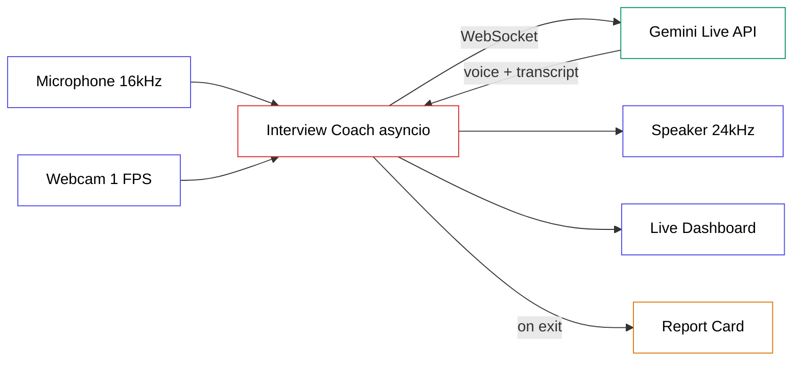

# Instagram Assets — Live AI Interview Coach

DM keyword: **COACH**

---

## Carousel Slides (10 slides)

Built on the 2026 carousel sweet spot: one idea per slide, a number + headline + one line, and a dedicated CTA slide at the end. Slide 1 is the only thing in-feed — it has to stop the scroll on its own.

**Slide 1 — Hook (cover)**
> I built an AI that watches me interview
> and tells me every time I say "um."

Subtext: Gemini Live • Python • runs free

**Slide 2 — The pain**
> You can't see yourself in an interview.
> The rushed pacing. The broken eye contact.
> The 6 filler words a minute.
> A camera that watches and coaches fixes that.

**Slide 3 — What it does**
> It watches your webcam and listens to your mic
> while you answer real interview questions —
> then coaches you out loud after every answer.
> Posture. Tone. Pacing. Filler words. Content.

**Slide 4 — The stack**
> → Gemini 3.1 Flash Live (free tier)
> → PyAudio for mic + speaker
> → OpenCV for the webcam
> → Rich for a live terminal dashboard
> No credit card. No cloud bill.

**Slide 5 — Step 1: stream both senses**
> 1 — Send the model everything at once
> Your voice goes up at 16kHz.
> One webcam frame goes up per second.
> The model hears AND sees you in real time.

**Slide 6 — Step 2: teach it patience**
> 2 — Tune the silence detector
> Default AI interrupts every time you pause.
> Set 3 seconds of silence before it replies.
> Now it waits — like a real interviewer.

**Slide 7 — Step 3: run 5 jobs at once**
> 3 — One event loop, five tasks
> Mic, camera, listen, speak, draw the screen.
> Python's asyncio juggles all five
> so nothing ever blocks anything else.

**Slide 8 — Step 4: the report card**
> 4 — Turn the talk into a document
> The live model speaks but hands you nothing.
> So a second model reads the transcript
> and writes a scored report when you finish.

**Slide 9 — What you actually learn**
> → Real-time multimodal streaming
> → Voice Activity Detection
> → Structured feedback from a live stream
> → A career-prep tool you'd actually use

**Slide 10 — CTA**
> Want the full build guide (free)?
> Comment COACH and I'll DM it to you.
> Save this so you can build it tonight.
> Follow @datasciencebrain for more.

---

## Captions (3 variants)

### Variant A — Problem hook

You can't coach what you can't see.

In a real interview you never notice the "ums," the rushed open, the eyes drifting off camera. So I built something that does.

An AI interview coach that watches your webcam and listens to your mic while you answer real questions — then coaches you out loud after every answer.

→ Counts your filler words
→ Reads your body language
→ Flags pacing and tone
→ Hands you a scored report at the end

All on Gemini's free tier. No credit card.

Comment COACH and I'll DM you the full build guide.

Save this for your next interview prep.

.
.
#datasciencebrain #aiindia #gemini #python #interviewprep #aiengineering #buildinpublic #careergrowth #machinelearning #codingindia

### Variant B — Career hook

Interview practice alone is broken. You read your answers in your head and they sound great. Then the real one starts and you fall apart.

This fixes the feedback gap.

It's a live AI coach that sees and hears you in real time — posture, eye contact, tone, filler words, content — and tells you exactly what to fix before the next question.

→ Watches your camera at 1 frame/sec
→ Waits 3 full seconds before replying, like a real interviewer
→ Talks back through your speakers
→ Writes you a report card when you're done

Built in Python with the Gemini Live API. Free to run.

Comment COACH and I'll send you the step-by-step guide.

Follow @datasciencebrain — we build one real AI project at a time.

.
.
#datasciencebrain #aiindia #careerprep #gemini #python #aiagents #jobsearch #aiengineering #learnpython #techindia

### Variant C — Contrast hook

A human interview coach: ₹2000 an hour.

This AI coach: free, patient, and available at 2am.

It watches you through your webcam and listens through your mic while you answer mock questions, then coaches you live — pacing, tone, eye contact, filler words, and whether your answer actually landed.

→ Real-time vision + audio analysis
→ Voice Activity Detection so it never cuts you off
→ Five async jobs running at once
→ A scored report card at the end

The whole thing runs on Gemini's free tier in Python.

Comment COACH for the full build guide in your DMs.

Save it. Build it tonight.

.
.
#datasciencebrain #aiindia #gemini #python #interviewcoach #aiproject #buildwithai #aiengineering #codenewbie #indiatech

---

## Auto-DM

```
Hey [Name] 👋

Here's your AI Interview Coach guide:
[PDF link]

What's inside:
→ Stream webcam + mic to Gemini Live in real time
→ Tune Voice Activity Detection so it never interrupts you
→ Generate a scored report card from the live transcript

To get started:
uv init interview-coach
uv add google-genai opencv-python pyaudio pillow python-dotenv rich

Full vault (all guides): [vault link]

Got questions? Reply here — happy to help.
```

---

## Mermaid Diagram



---

## Cover Image Prompt

> Extreme close-up of a young professional's face lit by the cool glow of a laptop screen in a dark room, eyes focused and slightly nervous mid-sentence, a faint reflection of a webcam ring light in their eye, shallow depth of field, single strong directional light from the screen carving the face out of shadow, cinematic, emotionally resonant, the quiet tension of being watched and judged, photographic realism, muted teal and warm skin tones --ar 16:9 --style raw --v 7
