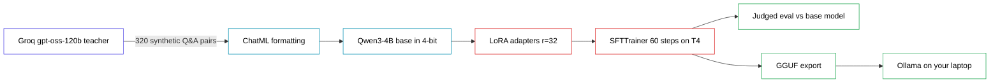

# Instagram Assets — Fine-Tune Your Own LLM for Free on Kaggle

## Captions

### Variant 1 — Problem Hook

Full fine-tuning of an LLM costs ₹8+ lakh in GPU compute.

LoRA trains 1.6% of the parameters and gets you 90% of the result — on a GPU Kaggle gives you for free.

→ Real 4B parameter model, not a toy
→ A bigger AI writes your training data for you
→ Trains in ~12 minutes on a free T4 GPU
→ Export it and run it on your own laptop

Comment FINETUNE and I'll DM you the guide.

#datasciencebrain #aiindia

### Variant 2 — Career Hook

LLM fine-tuning is the highest-paid AI specialisation right now — and almost nobody in India is teaching it hands-on.

Everyone can call an API. Very few people can hand a recruiter a model checkpoint that beats the base model on their own eval.

→ Build a Hinglish AI tutor from scratch
→ Use a 120B model to generate your training data for free
→ Fine-tune a 4B model with LoRA on Kaggle's free GPU
→ Prove it works with a judged before/after comparison

Comment FINETUNE and I'll DM you the guide.

#datasciencebrain #aiindia

### Variant 3 — Contrast Hook

Before: ask the AI to "reply in Hinglish" every single time, hope it remembers.

After: the AI just talks like that. Always. No prompt needed.

That's fine-tuning — you're not instructing the model anymore, you're changing what it is.

→ 300 examples generated by a free 120B model
→ Trained into a 4B model with LoRA, ₹0 spent
→ Runs offline on your own laptop after

Comment FINETUNE and I'll DM you the guide.

#datasciencebrain #aiindia

---

## Auto-DM

```
Hey [Name] 👋

Here's your LLM Fine-Tuning (LoRA on Kaggle) guide:
[PDF link]

What's inside:
→ Fine-tune a real 4B model on a free Kaggle GPU
→ Use a free 120B model to auto-generate your training data
→ Prove your fine-tune beats the base model with a judged eval
→ Export to GGUF and run it offline on your laptop

To get started:
uv init lora-finetune-kaggle
uv add groq

Full vault (all guides): [vault link]

Got questions? Reply here — happy to help.
```

---

## Mermaid Diagram (from GUIDE.md)



## Cover Image Prompt

```
Extreme close-up cinematic photograph, a person's hand delicately reaching into a large three-dimensional neural network rendered as a physical sculptural structure made of glowing interconnected threads and nodes, like a woven web of light suspended in a dark room, fingertips gently touching and adjusting one single glowing connection point while the rest of the network dims slightly in response, warm golden light emanating from the touched node contrasted against cool blue ambient glow from the rest of the structure, shallow depth of field with only the hand and touched node in sharp focus, the person's face barely visible in soft shadow at the edge of frame, focused and intent expression, dust and light particles drifting in the air, dark negative space filling most of the frame, moody atmospheric lighting, shot on 85mm lens, landscape orientation, subtle film grain, high-end tech editorial photography

--ar 16:9 --style raw --v 7
```

## Architecture Diagram Prompt (technical/academic style)

```
Clean academic research paper architecture diagram, flat vector technical illustration style like a figure from an ArXiv machine learning paper, white background, minimal color palette (navy blue, orange, gray accents only), thin black outlined rectangles connected by arrows showing left-to-right pipeline flow.

Diagram shows an LLM fine-tuning pipeline with these 6 stages in sequence:
1. A rectangle labeled "Teacher LLM (120B)" with a small cloud/API icon, generating a stack of small document icons labeled "Synthetic Q&A pairs"
2. An arrow into a rectangle labeled "Chat Template Formatting" with small text-bracket icons
3. An arrow into a larger rectangle labeled "Base Model (4B, 4-bit quantized)" drawn as a stack of neural network layer blocks, mostly grayed out/frozen except a few small orange highlighted blocks labeled "LoRA Adapters" attached to the side like small plug-in modules
4. An arrow into a rectangle labeled "Training Loop" with a small descending loss-curve icon inside
5. An arrow splitting into two paths: one labeled "Judged Evaluation" with a small scale/balance icon comparing two output boxes, another labeled "GGUF Export" with a small compressed-file icon
6. Final arrow into a rectangle labeled "Local Inference" with a small laptop icon

Precise thin lines, engineering-diagram aesthetic, sans-serif labels, generous white space, no gradients, no 3D effects, no photorealistic elements, no human figures, looks like Figure 1 from a NeurIPS or ACL paper

--ar 16:9 --style raw --v 7
```
