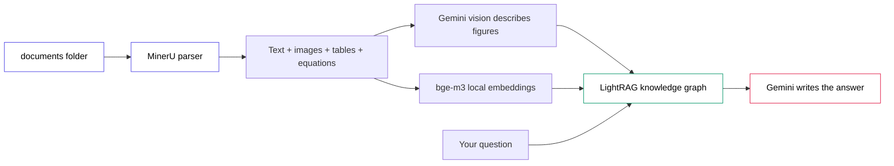

# RAG-Anything Document Chat (free stack)

Ingest a folder of documents — text, images, tables, equations — into one
knowledge graph, then chat with them, including multimodal queries. Built on
[RAG-Anything](https://github.com/HKUDS/RAG-Anything) (LightRAG under the hood).

Everything runs on a **free stack**:

- **LLM + Vision:** Google Gemini via its OpenAI-compatible endpoint. One key
  (`GEMINI_API_KEY`), one provider, native multimodal. Default model
  `gemini-2.5-flash` (free, fast, vision-capable).
- **Embeddings:** local `BAAI/bge-m3` (dim **1024**) via sentence-transformers.
  No API, no rate limit. The dimension is asserted at load time — a mismatch is
  the classic silent-retrieval-failure bug, so we fail loudly instead.
- **Parser:** MinerU (local, free). Verified with `check_parser_installation()`.

## Architecture



## Setup

### 1. Install dependencies (uv only)

```bash
uv sync
```

### 2. System dependencies

- **MinerU** ships with the `raganything` install. Verify it:
  ```bash
  PYTHONPATH=. uv run python -c "from raganything import RAGAnything, RAGAnythingConfig; print(RAGAnything(config=RAGAnythingConfig()).check_parser_installation())"
  ```
  It should print `True`.
- **LibreOffice** is required only for Office documents (`.docx`, `.pptx`,
  `.doc`, `.ppt`). PDFs need nothing extra. Install it from
  https://www.libreoffice.org/download and make sure `soffice` is on your PATH.
  Without it, Office files are skipped with a clear log message; PDFs still work.

### 3. API key

```bash
cp .env.example .env
# then edit .env and paste your key from https://aistudio.google.com/apikey
```

## Run it

Start with a **short, figure-heavy PDF** (a few pages). A sample
`documents/benchmark_report.pdf` (one figure + one table) is included so you can
verify the whole pipeline before pointing it at anything large.

```bash
# 1. Ingest the documents folder into the knowledge graph
PYTHONPATH=. uv run python -m app.main ingest ./documents

# 2a. Chat in the terminal
PYTHONPATH=. uv run python -m app.main chat

# 2b. Or launch the web UI (http://localhost:7860)
PYTHONPATH=. uv run python -m app.main ui
```

The first ingest downloads the MinerU models and the bge-m3 embedding model
(~2 GB), so it takes a few minutes. Subsequent runs are fast.

## Notes on the free tier

- **Vision quota:** describing figures calls the Gemini vision model. On a long,
  image-dense PDF this can exhaust the free vision quota. Start small and keep
  `max_workers` modest (default 2) so concurrent calls stay under the limit.
- **Rate limits (429):** handled automatically with exponential backoff in
  `app/config.py`. If you hit sustained 429s, lower `max_workers` or wait.
- Switch to the newer `gemini-3.5-flash` by setting `LLM_MODEL` /
  `VISION_MODEL` in `.env`. It is a heavier "thinking" model — smarter, but it
  consumes more free quota per call.

## Project layout

```
rag_anything_app/
├── app/
│   ├── config.py   # env, RAGAnythingConfig, the three model functions
│   ├── ingest.py   # folder ingestion (skips + logs any file that fails)
│   ├── chat.py     # async text + multimodal query layer
│   ├── ui.py       # Gradio chat UI
│   └── main.py     # CLI: ingest / chat / ui
├── documents/      # put your documents here (sample PDF included)
├── .env.example
└── README.md
```
