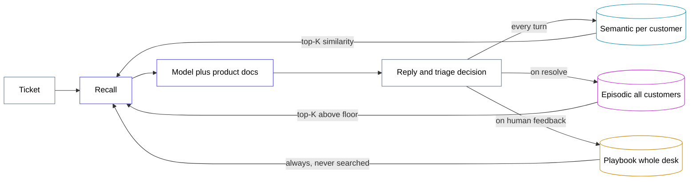

# recall-desk

A support triage agent with three kinds of long-term memory — semantic, episodic
and procedural — where each tier has its own scope, its own read policy, its own
write policy, and its own write trigger. Then a harness that switches each tier
off one at a time and shows that every one of them fails in a different,
diagnosable way.

Built on LangGraph 1.2, `SqliteStore` with sqlite-vec, local MiniLM embeddings,
and Groq's free `openai/gpt-oss-120b`.

> Verified 2026-08-12 — langgraph 1.2.11, langgraph-checkpoint-sqlite 3.1.1,
> sqlite-vec 0.1.9, sentence-transformers 5.7.0, langchain-groq 1.1.3,
> Python 3.14, Windows.

## Three tiers that are not variations on one idea

Most "agent memory" is one vector store with facts in it. These three differ on
five axes, and every difference has a reason behind it.

| | semantic | episodic | procedural |
|---|---|---|---|
| holds | this customer's account facts | resolved tickets: symptom, what was tried, root cause, fix | the triage playbook |
| **scope** | **one customer** | **every customer** | **the whole desk** |
| namespace | `("facts", cust_id)` | `("episodes",)` | `("playbook",)` |
| **indexed** | yes | yes | **no** |
| **read** | top-K by similarity | top-K by similarity, above a relevance floor | all of it, every turn |
| **write** | upsert; a new fact supersedes the one it contradicts | append-only, immutable | replace a rule, version bump, capped |
| **trigger** | any turn | on `/resolve` | only on human feedback |

Two of those rows carry the whole design.

**Procedural memory is never searched.** It is always in the prompt. That makes
it a fixed token tax on every single turn, which is why it is capped at six rules
and why it holds *behaviour* only — never diagnosis. Diagnostic knowledge in the
playbook would mean paying for it on every ticket whether or not it applies.

**Episodic memory is global while semantic memory is per customer.** A ticket
one customer raised in March is what solves a different customer's ticket in
August. Because it crosses customers, every episode is scrubbed of identity on
write: it stores a lesson, not a transcript.



## The store is not the checkpointer

Both are SQLite, and they do different jobs. Conflating them is the reason a lot
of "my agent has memory" code only remembers inside one conversation.

- **`SqliteSaver`** — the checkpointer. Carries the conversation within a thread.
- **`SqliteStore`** — the store. Carries facts, episodes and the playbook across
  threads.

Every probe in the harness runs on a **fresh `thread_id`** with the checkpointer
wired and working. So there is never any thread history to fall back on, and a
probe failure cannot be waved away as "it fell out of the context window."
Nothing was ever in the window. The store is the only bridge.

## Not everything belongs in memory

Plan limits, settlement windows, how to rotate a key — that is documentation. It
does not vary per customer and does not accumulate, so it lives in the system
prompt.

Answering *"why am I getting 429s?"* then needs one fact from memory (this
customer is on Growth) and one from the docs (Growth allows 500/min). Neither is
enough alone. The split is what stops the project from being one more "embed all
your documents" demo, and it is what makes the semantic probe measure exactly one
thing.

## Embed the symptom, not the fix

`index={"fields": ["text"]}` means **only** the `text` key of a stored value gets
a vector. Everything else in the dict is stored, returned and never embedded.

Episodes are retrieved by matching an incoming symptom, so `text` holds the
symptom in the words a customer would use, and the diagnosis rides along beside
it:

```python
store.put(("episodes",), key, {
    "text": "Webhooks stopped firing overnight. Nothing changed on our side.",  # embedded
    "tried": ["checked endpoint health", "verified the signing secret"],        # not embedded
    "root_cause": "the subscription auto-paused after 50 consecutive failures",
    "fix": "resume it from Dashboard > Webhooks > Resume",
})
```

Put the root cause in `text` and a symptom query retrieves it badly — the query
is about webhooks going quiet, the text is about pause thresholds. The searchable
surface and the useful payload are not the same string.

Measured on the four seeded episodes, a symptom query returns the right one at
**0.594** against a runner-up at **0.210**:

```
query: Our webhooks suddenly stopped arriving on the 4th. We changed nothing.
  1. 0.5940  Webhooks stopped firing overnight. Nothing changed o  kept
  2. 0.2097  Payments succeed in testing but every live call retu  below floor
  3. 0.1985  A shopper was charged twice for the same order.       below floor
  4. 0.1691  Our invoices are being rejected by our accountant.    below floor
```

The floor matters. Without it, a rate-limit ticket still gets the two nearest
episodes injected at ~0.18 similarity, paying tokens for lessons about webhooks
and 401s that have nothing to do with the question. The two searched tiers are
not symmetric here: the episode corpus grows without bound and most of it is
irrelevant to any given ticket, while a customer's account record is small and
almost always worth including. So episodic recall has a floor and semantic recall
does not.

## What the ablation shows

Method: **ablate the read, not the write.** Every config starts from an identical
seeded store and differs only in which tiers the recall step may look at.
Ablating writes instead would let the configs drift apart through many
uncontrolled paths; ablating reads moves exactly one variable.

```
PYTHONPATH=. uv run python -m src.ablate --repeats 2
```

| config | A (semantic) | B (episodic) | C (procedural) | control |
|---|---|---|---|---|
| all on | 1/1 | 2/2 | 2/2 | 2/2 |
| no semantic | **0/2** | 2/2 | 2/2 | 1/1 |
| no episodic | 2/2 | **0/2** | 2/2 | 2/2 |
| no procedural | 2/2 | 2/2 | **0/2** | 2/2 |
| no memory | **0/2** | **0/2** | **0/2** | 2/2 |

A clean diagonal: each ablation fails its own probe and passes the other two.

Two cells show 1/1 rather than 2/2 because 2 of those 40 calls came back as prose
instead of JSON and Groq rejected them — see the gotchas below. That is now
retried automatically; the run above predates the fix.

The **control probe** is the row that makes the rest of the table mean anything.
It asks something answerable from the static docs alone, so every config must
pass it. A harness where more memory always scores better is just rewarding
longer prompts.

What each failure actually looks like:

- **no semantic** — asked about 429s, the agent recites the whole price table
  ("Starter 100, Growth 500, Scale 2000") because it does not know which row
  applies. With the tier on: "Your Growth plan allows 500 requests per minute."
- **no episodic** — the webhook ticket gets a generic checklist: verify 2xx
  within 5 seconds, check DNS, check firewall rules. With the tier on: "The
  subscription likely auto-paused after 50 consecutive delivery failures. In
  Dashboard go to Webhooks and click Resume."
- **no procedural** — a 36-hour settlement delay gets a 14-line reply opening
  "Hi Acme Retail, I'm sorry you're experiencing a delay" and promising funds
  "by the next business day". With the tier on: one line, escalated, no date.

## Three things that will bite you

**`function_calling` structured output does not survive gpt-oss.** langchain's
default method makes the model invent a tool named after one of your schema's own
fields:

```
400 - attempted to call tool 'escalate' which was not in request.tools
```

`with_structured_output(schema, method="json_schema")` sends the schema as a
`response_format`, so there is no tool to hallucinate.

**`json_schema` is still not a guarantee.** Roughly one call in twenty returns
prose with no JSON in it, and Groq rejects the whole request:

```
400 - Failed to generate JSON. Please adjust your prompt.
failed_generation: 'Could you share the request ID? To rotate, go to Dashboard...'
```

The groq SDK retries 429s and 5xx but not 400s, because a 400 normally means your
request is malformed. Here the request is fine and the sample was bad, so the
retry has to be yours. `src/llm.py` retries with a nudge appended and the
temperature raised slightly, so the retry is not a rerun of the same sample.
Separately, with `include_raw=True` a failed parse arrives in-band as
`parsed=None` rather than raising — unchecked, that surfaces as an
`AttributeError` three frames from the cause.

**Models write typographic punctuation.** A check for `you're on the Growth plan`
never matches, because the model emits `you’re` with U+2019. On Windows the same
habit crashes the terminal outright:

```
UnicodeEncodeError: 'charmap' codec can't encode character ' '
```

That is a narrow no-break space, in a perfectly good answer. Normalise text
before matching it, and reconfigure stdout to UTF-8 before printing model output.

## Writing probes that actually measure something

Three of the four probes were wrong on the first attempt, and each was wrong in a
way that *looked* like a pass. This was the hardest part of the project, and it is
the part worth stealing.

**A loose assertion measures the model's vocabulary, not its memory.** Probe B
originally blamed a firewall egress allowlist and checked for
`egress|allowlist|firewall`. "Check your firewall rules" is advice the model
gives from general knowledge, so the probe passed with episodic memory switched
off. The fix was to make the root cause a mechanism no model can guess — an
arbitrary auto-pause threshold — and assert on `\b50\b`. Either it read the
episode or it did not. (`\b50\b`, not `"50"`, or `500 requests/minute` satisfies
it.)

**A probe can be sensitive to the wrong tier.** Probe A first checked "mentions
500 and no other tier". That failed whenever the *playbook* was off, because a
verbose answer lists every tier for completeness even when it knows the
customer's own. The probe was measuring terseness. What holds is the absence of
the price table: knowing the plan means not needing to recite all three.

**A tier can legitimately block another.** Probe B's customer was first seeded
with PaySetu-hosted webhooks, and the agent correctly refused to apply a
self-hosting lesson to them — a customer who does not host the endpoint has no
firewall in the path. Good reasoning, broken probe. A lesson only transfers when
its precondition holds.

**Enforce independence in code.** `src/seed.py` asserts that the plan and region
appear nowhere in episodic memory, that limits and settlement windows appear
nowhere in the account record, and that the auto-pause mechanism appears in
neither the facts nor the product docs. It has caught three real leaks, including
one where the phrase "behind a corporate firewall" in an account fact handed
probe B its own answer. `ablate.py` then greps the assembled context at runtime
and reports any probe answerable from a tier that was supposedly off.

## The write policies, and why they differ

**Semantic — upsert, enforced by the key.** Each fact is filed under a fixed
topic slug from a closed enum, so "we upgraded to Growth" lands on the same key as
"we're on Starter" and replaces it. Nothing depends on the model remembering what
it wrote last week. An open-ended topic string would let it file `plan` and
`plan_tier` separately and keep both contradicting facts; a naive `put` with a
fresh key does the same, and similarity search then cheerfully returns both.

**Episodic — append-only, and the failures are the point.** Episodes record what
was tried and did *not* work. An episode listing only the successful fix teaches
nothing about what to skip.

**Procedural — versioned, capped, and gated on a human.** Every edit bumps a
version and snapshots the previous one, so `/rollback 1` restores v1's rules as a
new version rather than deleting history. The cap is enforced in code: at six
rules, an `add` is rejected with a reason and only `replace` or `delete` get
through. And nothing edits the playbook unprompted — an agent that rewrites its
own operating instructions from an unprompted model call drifts within a few
turns.

Three triggers means three separate LLM calls with three different inputs. One
combined "reflect" call cannot do this: summarising a resolved ticket needs the
whole thread, while a playbook edit needs the feedback text plus the current
playbook.

## Setup

```bash
uv init recall-desk
uv add "langgraph>=1.2.10" "langgraph-checkpoint-sqlite>=3.1.1" "langchain-groq>=1.1.3" \
       "sentence-transformers>=5.7.0" "streamlit>=1.40" "python-dotenv>=1.2.2" "rich>=14.0.0"
```

Copy `.env.example` to `.env` and paste a free key from
[console.groq.com/keys](https://console.groq.com/keys):

```
GROQ_API_KEY=gsk_...
GROQ_MODEL=openai/gpt-oss-120b
```

`llama-3.3-70b-versatile` shuts down on 2026-08-16. Use `openai/gpt-oss-120b`.

## Run it

```bash
PYTHONPATH=. uv run python -m src.store       # put/search round-trip, real scores
PYTHONPATH=. uv run python -m src.seed        # account facts, 4 episodes, playbook v1
PYTHONPATH=. uv run python -m src.episodic    # retrieval smoke test, the gate
PYTHONPATH=. uv run python -m src.semantic    # the contradiction test
PYTHONPATH=. uv run python -m src.procedural  # cap, replace-at-cap, rollback
PYTHONPATH=. uv run python -m src.chat        # REPL, every recall and write shown
PYTHONPATH=. uv run streamlit run src/app.py  # three live memory panels
PYTHONPATH=. uv run python -m src.ablate --repeats 2
```

The first run downloads the MiniLM model (~90 MB). Nothing else leaves your
machine except the Groq calls — embeddings are local.

In the REPL: `/memory` dumps all three tiers, `/why` shows what was injected and
at what similarity, `/resolve` files an episode, `/feedback <text>` is the only
path to a playbook edit, `/who beta` switches customer, `/rollback 1` restores a
playbook version.

In Streamlit, switch customer in the sidebar: the semantic panel swaps to a
different account record while the episodes and playbook stay put. That is the
scope difference, on screen.

Groq's free tier is **200k tokens/day, org-wide**. A full ablation grid at 2
repeats is ~50k. `--config "all on"` and `--probe A` narrow the run while you
iterate.

## Files

| file | what it does |
|---|---|
| `src/store.py` | SqliteStore wiring, the namespace layout, direct construction |
| `src/embed.py` | MiniLM as a plain callable, lazy behind a lock |
| `src/semantic.py` | per-customer facts; upsert keyed by topic |
| `src/episodic.py` | global episodes; append-only, scrubbed, symptom in `text` |
| `src/procedural.py` | the playbook; unindexed, versioned, capped, rollback |
| `src/prompt.py` | static docs plus the enabled tiers, and a trace of what cost what |
| `src/agent.py` | LangGraph recall → answer → write, store and checkpointer both |
| `src/llm.py` | ChatGroq, `json_schema` structured output, JSON retry |
| `src/seed.py` | the fixture, and the probe-independence assertions |
| `src/probes.py` | four probes and their programmatic checks |
| `src/ablate.py` | the grid, the scorecard, the leak report |
| `src/chat.py` | REPL that shows every recall and every write |
| `src/app.py` | Streamlit inspector with three live panels |

## Known rough edges

The episode summariser embellishes. Asked to list what was tried, it sometimes
invents plausible dead ends that were never actually attempted in the
conversation. The scrubbing holds — customer names and request IDs do get
stripped — but the `tried` list should be read as a summary, not a log.

Probe C's four rules are not equally stable. "Promises no timeline" and "no
apology opener" flip reliably when the playbook is removed; "escalates" and
"5 lines or fewer" sometimes hold anyway, because the model's defaults happen to
agree with the rule. The per-check table reports each separately rather than
hiding that behind one number.

## What to build next

- **Decay.** `TTLConfig` supports `default_ttl` and `sweep_interval_minutes`.
  Account facts should probably expire; episodes probably should not.
- **Conflict resolution for open-ended facts.** The `other` topic falls back to a
  content hash, so two contradicting free-form facts can coexist. Fixed topics
  do not have this problem, which is the argument for a closed enum.
- **Promote a repeated episode into the playbook.** If the same lesson gets
  recalled on ten tickets, it may have earned its place in the always-on tier.
  That is a real decision with a real cost, and it needs a rule.
