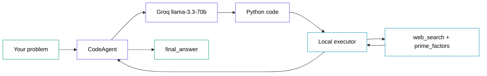

# Build a Code Agent That Writes Python to Solve Any Problem in 20 Minutes

> Verified 2026-06-08 — smolagents==1.26.0, litellm==1.88.0, pandas==3.0.3, numpy==2.4.6, python-dotenv==1.2.2, Python 3.12

## Table of Contents

1. What You're Building
2. Architecture
3. Prerequisites and Setup
4. Configuration — config.py
5. A Custom Tool — tools.py
6. The Agent — agent.py
7. The CLI Loop — main.py
8. Run It End to End
9. Common Errors and Fixes
10. What to Build Next

---

## 1. What You're Building

A command-line agent that takes any problem you type and solves it by writing Python, running that Python, reading the result, and answering. It can search the web for live facts and call a custom tool you define. The model doing the thinking is Groq's free `llama-3.3-70b-versatile`, so no credit card is needed.

This is the defining trick of [smolagents](https://github.com/huggingface/smolagents): instead of emitting JSON tool calls, a `CodeAgent` writes actual Python code as its action, then executes it in a sandbox. That makes it strong at multi-step problems — math, data analysis, lookups — where the steps aren't known in advance.

---

## 2. Architecture



You type a problem into the **CodeAgent**. It sends the problem to the **Groq** model, which replies with a snippet of **Python code**. The agent runs that code in its **local executor** sandbox, where the code may call the bundled tools — **web_search** for live facts and **prime_factors** for exact factorisation — and import an allowlisted set of modules. The executor's output goes back to the agent, which either writes more code for the next step or calls **final_answer** to stop and return the result.

---

## 3. Prerequisites and Setup

You need **Python 3.12** (smolagents itself supports 3.10+, but this project pins 3.12).

You need one free API key:

- **Groq** — sign up at [console.groq.com/keys](https://console.groq.com/keys). No credit card. This powers the agent's reasoning.

Create the project and install the packages. The `litellm` extra gives you the Groq connector; the `toolkit` extra gives you the web search tool. `pandas` and `numpy` are separate installs because the agent's generated code imports them.

```bash
uv init smolagents-code-agent
cd smolagents-code-agent
uv add "smolagents[litellm,toolkit]" python-dotenv pandas numpy
```

Create a `.env.example` so the key's name is documented, then copy it to a real `.env` and paste your key in. The real `.env` is never committed.

```
# .env.example
GROQ_API_KEY=
```

Your `.gitignore` should list `.env`, `__pycache__/`, and `.venv/`. All application code lives in `src/`.

---

## 4. Configuration — config.py

This file is the single place every setting lives: the model name, the step limit, and the list of modules the agent's generated code is allowed to import. Keeping them here means no magic strings are scattered through the rest of the code.

The most important detail is the model string. Groq is reached through LiteLLM, and LiteLLM needs a provider prefix to know where to route the call. Writing `groq/llama-3.3-70b-versatile` tells it to use the native Groq provider — not the OpenAI-compatible endpoint, which mishandles smolagents' system messages.

```python
# src/config.py
import os

from dotenv import load_dotenv

# Load .env before anything reads GROQ_API_KEY or builds a model client.
load_dotenv()

# Groq's free-tier model, addressed through LiteLLM's native "groq/" prefix.
MODEL = "groq/llama-3.3-70b-versatile"

# Hard cap on how many write-and-run cycles the agent may take per problem.
MAX_STEPS = 8
```

The second half of the file holds the import allowlist and a helper that fails loudly when the key is missing. smolagents blocks every import in generated code by default; this list is what lets the agent reach for the data and math toolkit while keeping `os`, `sys`, and `subprocess` out of reach.

```python
# src/config.py (continued)

# Modules the agent's generated code is allowed to import.
AUTHORIZED_IMPORTS = [
    "pandas", "numpy", "math", "statistics", "datetime",
    "json", "re", "collections", "itertools",
]


def get_api_key() -> str:
    """Return the Groq API key, or raise a clear error if it is missing."""
    key = os.environ.get("GROQ_API_KEY")
    if not key:
        raise RuntimeError(
            "GROQ_API_KEY is not set. Copy .env.example to .env and paste your "
            "key from https://console.groq.com/keys"
        )
    return key
```

To verify: run `PYTHONPATH=. uv run python -c "from src.config import MODEL; print(MODEL)"` and confirm it prints `groq/llama-3.3-70b-versatile`.

---

## 5. A Custom Tool — tools.py

A tool is a normal Python function wrapped in the `@tool` decorator. smolagents reads the function's type hints and its `Args:` docstring block to build the schema it shows the model. Both are required — a missing argument description raises an error when the agent is built, not at run time.

This tool returns the prime factors of an integer. It's a good example because exact integer factorisation is the kind of thing a model is better off offloading to tested code than writing inline every time.

```python
# src/tools.py
from smolagents import tool


@tool
def prime_factors(n: int) -> list[int]:
    """Return the prime factors of a positive integer, smallest first.

    Use this for exact integer factorisation instead of writing your own
    loop; it is reliable for large numbers and avoids off-by-one mistakes.

    Args:
        n: The positive integer to factorise. Must be 2 or greater.
    """
    if n < 2:
        raise ValueError("n must be 2 or greater")
```

The body is a standard trial-division loop. It divides out each factor as it finds it, so the same prime is appended once per occurrence, and anything left above 1 at the end is itself prime.

```python
# src/tools.py (continued)
    factors: list[int] = []
    divisor = 2
    remaining = n
    while divisor * divisor <= remaining:
        while remaining % divisor == 0:
            factors.append(divisor)
            remaining //= divisor
        divisor += 1
    if remaining > 1:
        factors.append(remaining)
    return factors
```

To verify: `PYTHONPATH=. uv run python -c "from src.tools import prime_factors; print(prime_factors(360))"` should print `[2, 2, 2, 3, 3, 5]`.

---

## 6. The Agent — agent.py

This file assembles the pieces into a ready-to-run `CodeAgent`. It builds the Groq model through `LiteLLMModel`, gives the agent its tools, and passes the import allowlist and step cap from config.

Two tools go in: the built-in `WebSearchTool` (DuckDuckGo, from the `toolkit` extra) for live facts, and the custom `prime_factors`. Inside the agent's generated code these are called as `web_search(...)` and `prime_factors(...)`.

```python
# src/agent.py
from smolagents import CodeAgent, LiteLLMModel, WebSearchTool

from src.config import AUTHORIZED_IMPORTS, MAX_STEPS, MODEL, get_api_key
from src.tools import prime_factors


def build_agent() -> CodeAgent:
    """Construct a ready-to-run CodeAgent with model, tools, and limits."""
    model = LiteLLMModel(model_id=MODEL, api_key=get_api_key())
    tools = [WebSearchTool(), prime_factors]
```

The `CodeAgent` call ties it together. `additional_authorized_imports` is the allowlist from config. `max_steps` bounds how many write-and-run cycles one problem may take. `verbosity_level=2` prints each code block the agent writes and its execution output — that visible loop is the whole point of the demo.

```python
# src/agent.py (continued)
    return CodeAgent(
        tools=tools,
        model=model,
        additional_authorized_imports=AUTHORIZED_IMPORTS,
        max_steps=MAX_STEPS,
        verbosity_level=2,
    )
```

To verify: `PYTHONPATH=. uv run python -c "from src.agent import build_agent; build_agent(); print('built')"` should print `built` with no error. If an allowlisted module isn't installed, this is where it fails — see Common Errors.

---

## 7. The CLI Loop — main.py

The entrypoint is a small loop: read a problem, run the agent, print the answer, repeat. Each call to `agent.run` starts with a fresh memory, so one problem never leaks context into the next.

```python
# src/main.py
from src.agent import build_agent


def main() -> None:
    """Read problems in a loop and let the agent solve each with code."""
    agent = build_agent()
    print("smolagents Code Agent (Groq + LiteLLM)")
    print("Describe any problem. The agent writes Python, runs it, answers.")
    print("Press Enter on an empty line or type 'exit' to quit.\n")

    while True:
        task = input("Problem> ").strip()
        if not task or task.lower() == "exit":
            print("Bye.")
            return

        answer = agent.run(task)
        print(f"\n=== Final answer ===\n{answer}\n")


if __name__ == "__main__":
    main()
```

To verify: the next section runs it end to end.

---

## 8. Run It End to End

Make sure your real `.env` has a valid `GROQ_API_KEY`, then start the loop:

```bash
PYTHONPATH=. uv run python -m src.main
```

Ask a pure-compute question that also uses the custom tool:

```
Problem> What is the 118th Fibonacci number? Also list its prime factors using the prime_factors tool.
```

You'll see the agent write code, run it, and finish. The output is truncated here:

```
─ Executing parsed code: ──────────────────────────────────
  fib = [0, 1]
  for i in range(2, 119):
      fib.append(fib[-1] + fib[-2])
  print(prime_factors(fib[118]))
...
Final answer: The 118th Fibonacci number is 2046711111473984623691759
and its prime factors are [353, 709, 8969, 336419, 2710260697]
```

Two more problems prove the range. A data question pulls in numpy; a factual question triggers the web search tool:

```
Problem> Given [8,3,5,1,9,2], compute the mean, median, and population standard deviation. Use numpy.
Final answer: Mean: 4.666666666666667, Median: 4.0, Population Standard Deviation: 2.981423969999719

Problem> Who is the current CEO of Hugging Face?
Final answer: Clément Delangue
```

Type `exit` to quit.

---

## 9. Common Errors and Fixes

| Error Message | Cause | Fix |
|---|---|---|
| `InterpreterError: Non-installed authorized modules: numpy, pandas. Please install these modules or remove them from the authorized imports list.` | smolagents 1.26 checks at build time that every module in `additional_authorized_imports` is actually installed. It does not pull pandas/numpy in for you. | `uv add pandas numpy`, or drop the unused names from `AUTHORIZED_IMPORTS`. |
| `litellm.exceptions.BadRequestError: LLM Provider NOT provided. Pass in the LLM provider you are trying to call.` | The model id has no provider prefix, e.g. `llama-3.3-70b-versatile`. LiteLLM can't tell which backend to use. | Prefix it: `groq/llama-3.3-70b-versatile`. |
| `litellm.AuthenticationError: ... Invalid API Key` | `GROQ_API_KEY` is wrong, expired, or has a trailing space. | Regenerate the key at console.groq.com/keys and paste it cleanly into `.env`. |
| `RuntimeError: GROQ_API_KEY is not set.` | No `.env` file, or `load_dotenv()` didn't find the key. On Windows `uv run` does not inherit `.env` automatically. | Copy `.env.example` to `.env`, paste the key, and confirm `load_dotenv()` runs at the top of `config.py`. |
| `ModuleNotFoundError: No module named 'src'` | The run command was missing the `PYTHONPATH=.` prefix, so Python can't see the `src/` package. | Always run with `PYTHONPATH=. uv run python -m src.main`. |
| 400 from Groq about an unexpected system message | Reaching Groq through the OpenAI-compatible endpoint (`openai/...` + `api_base=https://api.groq.com/openai/v1`) instead of the native provider. | Use the `groq/` prefix with `LiteLLMModel`; do not set `api_base`. |

---

## 10. What to Build Next

- Add a custom `@tool` that reads a local CSV with pandas, so the agent can answer questions about your own data instead of only computed or searched facts.
- Swap the local executor for a sandboxed one by passing `executor_type="docker"` (or `"e2b"`) to `CodeAgent`, so untrusted generated code never touches your machine.
- Wrap the agent in `GradioUI(agent).launch()` to get a browser chat that streams the agent's thinking, instead of the terminal loop.
