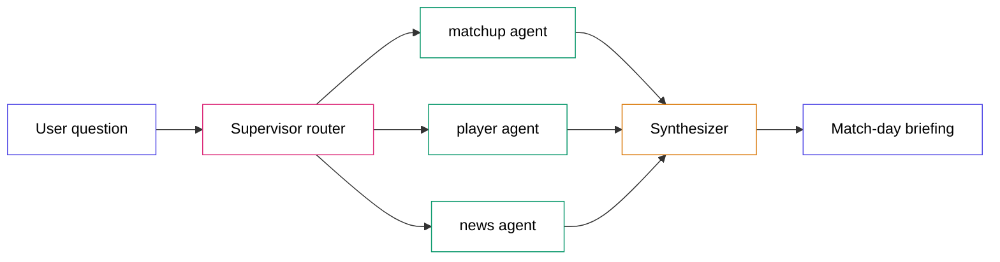

# Build a Parallel Multi-Agent World Cup Analyst in 60 Minutes

> Verified 2026-06-18 — langgraph==1.2.5, langchain-groq==1.1.3, langchain-core==1.4.7, tavily-python==0.7.26, feedparser==6.0.12, httpx==0.28.1, pydantic==2.13.4, Python 3.12.

You ask one question — *"Give me a briefing on Brazil's next match"* — and three independent AI agents wake up at the same time, each go off and gather their own slice of the story, and a final writer stitches their findings into one match preview. All on free APIs. No credit card.

This guide builds that system and, more importantly, teaches you *why* every piece exists.

---

## Table of Contents

1. [What You're Building](#1-what-youre-building)
2. [The Vocabulary You Need First](#2-the-vocabulary-you-need-first)
3. [Architecture](#3-architecture)
4. [End-to-End Walkthrough](#4-end-to-end-walkthrough)
5. [Prerequisites & Setup](#5-prerequisites--setup)
6. [Step 1 — Configuration and the Two-Model Strategy](#6-step-1--configuration-and-the-two-model-strategy)
7. [Step 2 — Data Models and a Safe Result Wrapper](#7-step-2--data-models-and-a-safe-result-wrapper)
8. [Step 3 — The Async Data Client](#8-step-3--the-async-data-client)
9. [Step 4 — More Sources: News and Player Bios](#9-step-4--more-sources-news-and-player-bios)
10. [Step 5 — Shared State and Reducers](#10-step-5--shared-state-and-reducers)
11. [Step 6 — Tools: Giving Agents Hands](#11-step-6--tools-giving-agents-hands)
12. [Step 7 — The ReAct Loop: What Makes a Worker an Agent](#12-step-7--the-react-loop-what-makes-a-worker-an-agent)
13. [Step 8 — The Three Agents](#13-step-8--the-three-agents)
14. [Step 9 — The Supervisor (Router)](#14-step-9--the-supervisor-router)
15. [Step 10 — The Synthesizer (Fan-In)](#15-step-10--the-synthesizer-fan-in)
16. [Step 11 — The Graph: Parallel Fan-Out with Send](#16-step-11--the-graph-parallel-fan-out-with-send)
17. [Step 12 — The CLI](#17-step-12--the-cli)
18. [Run It End-to-End](#18-run-it-end-to-end)
19. [Common Errors & Fixes](#19-common-errors--fixes)
20. [Free-Tier Limitations You Must Know](#20-free-tier-limitations-you-must-know)
21. [Improvements You Can Make](#21-improvements-you-can-make)
22. [Knowledge Check](#22-knowledge-check)
23. [What You Should Remember](#23-what-you-should-remember)
24. [Key Terms Learned](#24-key-terms-learned)

---

## 1. What You're Building

You're building a command-line tool that produces a **match-day briefing** for any World Cup team. The user types a question, and the system returns the team's next opponent, a form comparison, a scouted key player, and the latest team news — assembled by several AI agents working at the same time.

**Real-world use case:** This is the same pattern behind "research assistant" products — a coordinator that delegates sub-questions to specialists and merges their answers. Swap football data for financial data and you have an earnings-report analyst. Swap it for medical literature and you have a research summarizer. The orchestration is the transferable skill.

**The user experience** is a single command:

```bash
PYTHONPATH=. uv run python app/main.py "Give me a briefing on Brazil's next match"
```

and a few seconds later, a written preview.

**Technologies used:** LangGraph (orchestration), LangChain + Groq (the LLM and tool-calling), httpx (async HTTP), pydantic (data validation), plus three free data sources.

**Why build this:** "Multi-agent orchestration" is the most-asked AI engineering interview topic of the year. This project teaches it concretely — not slideware, but running code you can explain line by line.

---

## 2. The Vocabulary You Need First

This project leans on a handful of terms. We define each one the moment it appears later, but here is the map so nothing feels sudden.

### LLM

A Large Language Model is a program that takes text and predicts useful text back. We use Groq's hosted Llama models because they are free and fast.

### Agent

An agent is an LLM-powered system that **decides what actions to take**, instead of following a fixed script. Give it a goal and some tools, and it chooses which tools to use and when.

### Tool

A tool is a plain Python function the model is allowed to call. The model doesn't run the function itself — it says "call `get_top_scorers`," your code runs it, and the result goes back to the model.

### Node

A node is a single step in a workflow. In this project, each agent is a node.

### Edge

An edge decides which node runs next. A *conditional* edge decides at runtime based on the data.

### State

State is the shared data passed between nodes. Think of it as a clipboard handed from step to step.

### Graph

A graph is the whole workflow: nodes connected by edges. LangGraph is the library that runs it.

### Async

Asynchronous Python lets one program wait for many slow things (like web requests) at the same time instead of one after another. It is the engine that makes "parallel" possible here.

After this section, we use these terms normally and deepen them with examples.

---

## 3. Architecture

Here is the whole system in one picture.



### Complete Flow (left to right)

The **user** asks a question. The **supervisor** reads it, decides which specialists are needed, and looks up one fact everything depends on: who the team plays next. It then launches the **three agents at the same time**. Each agent gathers its own data and writes a short section. When all three finish, the **synthesizer** merges their sections into one briefing, which is returned to the user.

### Component Breakdown

**Supervisor (router).** Receives the raw question. Produces a list of which agents to run plus the resolved next-match context (opponent, date). It exists to avoid running irrelevant work and to resolve shared facts once instead of three times.

**matchup_agent.** Receives the team and opponent. Produces a form-and-standings comparison. It solves the problem "is this team in good shape for *this specific* opponent?"

**player_agent.** Receives the team. Produces a scouted key player. It solves "who is the danger man, and what do we actually know about them?"

**news_agent.** Receives the team and opponent. Produces an injuries-and-storylines read. It solves "what just happened that the numbers don't show?"

**Synthesizer (fan-in).** Receives all three sections. Produces one cohesive preview. It exists because three separate paragraphs are not a briefing — a human editor is needed to weave them.

### Data Flow

The question enters as a **string**. The supervisor turns it into a small **structured object** (which agents, which team). Each agent turns API responses (JSON) into **compact text findings**. The synthesizer turns the list of findings into a final **string**. Every transformation exists to move from messy raw data toward a single readable answer.

---

## 4. End-to-End Walkthrough

Before any code, follow one real request through the system.

User asks: *"Give me a briefing on Brazil's next match"*

1. The CLI passes the string into the graph.
2. The **supervisor** uses a small, fast model to read the question: focus team = Brazil, run all three agents.
3. The supervisor calls the football API once to resolve Brazil's id, then asks for Brazil's next fixture — it learns: **Brazil vs Haiti, 2026-06-20**. It stores this in the shared state.
4. LangGraph launches **all three agents at once**.
5. The **matchup_agent** decides to call its form tool for Brazil, its form tool for Haiti, and its standings tool — then writes a comparison.
6. The **player_agent** calls its scorers tool, finds Brazil's scorer (Vinícius Júnior), calls its profile tool to learn his position and club, then scouts him.
7. The **news_agent** calls its RSS tool and a news-search tool, finding the coach's post-match comments, then summarizes.
8. All three finish. The **synthesizer** receives the three findings plus the fixture, and writes one preview that opens with "Brazil takes on Haiti on June 20…".
9. The user sees the briefing.

Notice step 4. Steps 5, 6, and 7 happen **simultaneously**, not in sequence. That is the "parallel" in the title, and we will see exactly how LangGraph does it.

---

## 5. Prerequisites & Setup

### Package manager

We use **uv**, a fast Python package manager. If you don't have it:

```bash
# macOS / Linux
curl -LsSf https://astral.sh/uv/install.sh | sh
# Windows (PowerShell)
powershell -c "irm https://astral.sh/uv/install.ps1 | iex"
```

### Create the project

```bash
uv init worldcup-analyst
cd worldcup-analyst
uv add langgraph langchain-groq httpx pydantic python-dotenv tavily-python feedparser
```

`uv add` installs a package and records it in `pyproject.toml`. `langchain-core` (which gives us the tool decorator) arrives automatically as a dependency of `langchain-groq`.

### Get your free keys

You need two keys; a third is optional.

| Key | Required? | Where (free, no card) |
|---|---|---|
| `GROQ_API_KEY` | Yes | https://console.groq.com/keys |
| `FOOTBALL_DATA_TOKEN` | Yes for live data | https://www.football-data.org/client/register |
| `TAVILY_API_KEY` | Optional | https://app.tavily.com |

Create a file named `.env` in the project root:

```
GROQ_API_KEY=your_groq_key
FOOTBALL_DATA_TOKEN=your_football_token
TAVILY_API_KEY=
```

The `.env` file holds secrets and must never be committed. Add it to `.gitignore`.

### Verify Your Progress

```bash
PYTHONPATH=. uv run python -c "import langgraph, langchain_groq, httpx; print('deps ok')"
```

Expected output:

```text
deps ok
```

`PYTHONPATH=.` tells Python "treat the current folder as the import root." Without it, `import app.config` fails. We prefix every run command with it.

---

## 6. Step 1 — Configuration and the Two-Model Strategy

### Why before how

**Problem:** Groq's free tier limits how many tokens you can spend per minute and per day, **and the limit is counted separately for each model**. The big, smart model (`llama-3.3-70b-versatile`) has a small daily budget (~100,000 tokens). If every agent uses it, a single briefing's many calls drain the budget fast.

**Why this matters:** This project's whole promise is "runs on free APIs." A design that rate-limits after a few runs breaks that promise.

**Solution:** Use two models. A small, cheap model (`llama-3.1-8b-instant`) for the agents' decision-making, and the big model only for the final paragraph the reader actually sees.

**Why it works:** The small model has a much larger free budget and is perfectly capable of "pick a tool and relay the result." The big model is reserved for polished prose, where quality matters most. Because budgets are per-model, the two never compete.

### Implementation

Create `app/config.py`. First, load secrets and define the models:

```python
import os
from dataclasses import dataclass
from dotenv import load_dotenv
from langchain_groq import ChatGroq

load_dotenv()  # read .env into the environment before anything else

LIGHT_MODEL = "llama-3.1-8b-instant"      # router + agent tool-loops
HEAVY_MODEL = "llama-3.3-70b-versatile"   # final synthesis only
```

`load_dotenv()` must run before any code reads a key. On Windows especially, `uv run` does not inject `.env` automatically, so this call is mandatory.

Now the model factories. A factory is just a function that builds and returns a fresh client:

```python
def agent_model() -> ChatGroq:
    """The cheap 8b model that drives the agents' tool loops."""
    return ChatGroq(model=LIGHT_MODEL, api_key=SETTINGS.groq_api_key, temperature=0.0)

def heavy_model() -> ChatGroq:
    """The 70b model for the final reader-facing synthesis."""
    return ChatGroq(model=HEAVY_MODEL, api_key=SETTINGS.groq_api_key, temperature=0.3)
```

Always pass `model=` (not the old `model_name=`, which is deprecated). `temperature` controls randomness: `0.0` makes tool decisions deterministic; a small value for synthesis adds natural variety.

### Common Confusions

**Q: Why two models instead of just the good one everywhere?**
A: Because the good model's *daily* free budget is small. Spreading work across two models means two separate budgets, so you get far more runs per day.

**Q: Is the 8b model "worse"?**
A: For writing it is. But the agents don't write the final text — they gather facts. The 70b synthesizer rewrites everything at the end, so the reader still gets 70b-quality prose.

### Questions You Should Now Be Able To Answer

1. Why does this project use two different models?
2. What does `load_dotenv()` do and why must it run first?
3. What would happen on the free tier if every agent used the 70b model?

---

## 7. Step 2 — Data Models and a Safe Result Wrapper

### Why before how

**Problem:** External APIs return raw JSON dictionaries. If you read fields like `data["score"]["fullTime"]["home"]` directly, one missing field crashes the program.

**Solution:** Use **pydantic** models. A pydantic model is a typed Python class that validates incoming data and gives you safe, named attributes. The football API speaks camelCase (`utcDate`); we map those to clean Python names with *aliases*.

### Implementation

Create `app/data/models.py`. A shared base lets every model accept the API's camelCase keys:

```python
from pydantic import BaseModel, ConfigDict, Field

class _Camel(BaseModel):
    model_config = ConfigDict(populate_by_name=True, extra="ignore")
```

`extra="ignore"` means "if the API sends fields we didn't declare, drop them silently" — so the model never breaks when the API adds something.

A match model, with every field optional so a thin payload never fails validation:

```python
class Match(_Camel):
    utc_date: str | None = Field(default=None, alias="utcDate")
    status: str | None = None
    venue: str | None = None
    home_team: TeamRef = Field(default_factory=TeamRef, alias="homeTeam")
    away_team: TeamRef = Field(default_factory=TeamRef, alias="awayTeam")
```

`alias="utcDate"` tells pydantic "the JSON calls this `utcDate`, but I want to read it as `utc_date`." Making everything `| None` is deliberate: a scheduled match has no score yet, so those fields arrive empty.

### A wrapper that never crashes the program

**Problem:** Any single API call can fail — bad token, timeout, rate limit. If one agent's call raising an exception kills the whole graph, the user gets nothing.

**Solution:** Every data call returns an `ApiResult` — either data *or* a clean error string, never an exception escaping to the caller.

Create `app/data/results.py`:

```python
from dataclasses import dataclass
from typing import Generic, TypeVar
import httpx

T = TypeVar("T")

@dataclass
class ApiResult(Generic[T]):
    data: T | None = None
    error: str | None = None
    transient: bool = False   # True if a retry might help (timeout / 429)

    @property
    def ok(self) -> bool:
        return self.error is None and self.data is not None
```

The `transient` flag is important later: it marks failures worth *retrying* (a timeout) versus ones that won't change on retry (a bad token). We decide that with a small helper:

```python
def is_transient(exc: Exception) -> bool:
    if isinstance(exc, httpx.TimeoutException):
        return True
    if isinstance(exc, httpx.HTTPStatusError):
        return exc.response.status_code == 429 or exc.response.status_code >= 500
    return False
```

### Mental Model

Think of `ApiResult` as a **sealed delivery box**. It always arrives. Inside is either the parcel (`data`) or a note explaining why it's empty (`error`). The receiver never gets hit by a falling package (an exception) — they just open the box and check.

### Questions You Should Now Be Able To Answer

1. Why is every field in `Match` optional?
2. What does an alias do in a pydantic model?
3. Why return an `ApiResult` instead of letting exceptions propagate?

---

## 8. Step 3 — The Async Data Client

### Why before how

**Problem:** We need football data from one place so the rest of the app doesn't care *how* it's fetched. And we need it **async**, so three agents can call it at the same time.

**Async, plainly:** Normal Python does one thing, waits, then the next. Async Python can start a web request, and *while waiting for the reply*, start another. For three agents that each wait on the network, this is the difference between 6 seconds and 2.

**Solution:** One class, `FootballDataClient`, using the async HTTP library `httpx`. It is the **only** place that talks to football-data.org — swap this file and you've swapped data sources.

### Implementation

Create `app/data/client.py`. The football API authenticates with a header named `X-Auth-Token`:

```python
class FootballDataClient:
    def __init__(self) -> None:
        self._token = SETTINGS.football_token
        headers = {"X-Auth-Token": self._token} if self._token else {}
        self._http = httpx.AsyncClient(
            base_url="https://api.football-data.org/v4",
            headers=headers, timeout=15.0,
        )
```

Every public method wraps its work in a try/except and returns an `ApiResult`, so a failure degrades into a message instead of a crash:

```python
async def standings(self) -> ApiResult[list[GroupStanding]]:
    try:
        payload = await self._get(f"/competitions/WC/standings")
        groups = [GroupStanding.model_validate(s)
                  for s in payload.get("standings", []) if s.get("type") == "TOTAL"]
        return ApiResult(data=groups)
    except Exception as exc:
        return ApiResult(error=explain_error(exc), transient=is_transient(exc))
```

`await` means "start this and let other work run until the reply arrives." `model_validate` runs the raw dict through pydantic.

### The next-match lookup

The whole point is the *next* match, so we fetch upcoming fixtures and pick the soonest one that hasn't finished:

```python
async def next_match(self, team_id: int) -> ApiResult[Match]:
    today = date.today()
    payload = await self._get(f"/teams/{team_id}/matches", params={
        "competitions": "WC",
        "dateFrom": today.isoformat(),
        "dateTo": (today + timedelta(days=60)).isoformat()})
    upcoming = [m for m in (Match.model_validate(x) for x in payload.get("matches", []))
                if m.status not in {"FINISHED", "IN_PLAY", "PAUSED"}]
    upcoming.sort(key=lambda m: m.utc_date or "")
    return ApiResult(data=upcoming[0]) if upcoming else ApiResult(error="no fixture")
```

### A cache that protects the free tier

**Performance problem:** The free football tier allows only **10 requests per minute**. Three parallel agents plus the supervisor can easily fire 7+ calls in one burst, and re-running the program repeats them all.

**The optimization:** A small in-memory cache. Before each request we check a dictionary keyed by URL; if we fetched the same thing in the last 90 seconds, we reuse it.

```python
_CACHE: dict[str, tuple[float, dict]] = {}
_CACHE_TTL_SECONDS = 90.0

# inside _get(), before the network call:
cached = _CACHE.get(key)
if cached and time.monotonic() - cached[0] < _CACHE_TTL_SECONDS:
    return cached[1]
```

**Without it:** repeated runs and parallel agents trip the 10/min limit and you get `429 Too Many Requests`. **With it:** identical calls cost one request, not many.

### Verify Your Progress

With your token in `.env`:

```bash
PYTHONPATH=. uv run python -c "
import asyncio
from app.data.client import FootballDataClient
async def go():
    async with FootballDataClient() as c:
        r = await c.resolve_team_id('Brazil')
        print('Brazil id:', r.data.id if r.ok else r.error)
asyncio.run(go())"
```

Expected output (the id is stable):

```text
Brazil id: 764
```

### Questions You Should Now Be Able To Answer

1. Why must the client be async for this project specifically?
2. What problem does the 90-second cache solve, and what error appears without it?
3. Why is *all* HTTP code kept in one file?

---

## 9. Step 4 — More Sources: News and Player Bios

A single source makes a thin analyst. We add two more, each behind its own client.

### The news client

**Problem:** Official football data has scores and tables but no narrative — no injuries, no momentum, no storylines.

**Solution:** Two free news sources. **RSS feeds** (BBC, Guardian) need no key at all. **Tavily** is an AI search API with a free tier that returns fresh, team-specific results when you provide a key.

In `app/data/news.py`, RSS feeds are fetched with httpx and parsed with `feedparser`:

```python
async def fetch_rss(self, team: str, limit: int = 6) -> ApiResult[list[NewsItem]]:
    feeds = await asyncio.gather(*(self._one_feed(s, u) for s, u in RSS_FEEDS.items()),
                                 return_exceptions=True)
    items = [i for feed in feeds if isinstance(feed, list) for i in feed]
    relevant = [i for i in items if _mentions(i, team)]
    return ApiResult(data=relevant[:limit])
```

`asyncio.gather` runs both feed downloads at once — the same parallel trick, one level down. We keep only items that mention the team.

The Tavily call is skipped automatically when no key is set, so the app still works on RSS alone:

```python
if not SETTINGS.has_tavily:
    return ApiResult(error="Tavily not configured")
```

### The player-bio client

**Problem:** The free football tier exposes a competition-wide *top scorers* list, but no per-team rosters or player bios.

**Solution:** TheSportsDB, a free sports database with a public demo key (`123`). Its per-player search returns position, club, nationality, and date of birth.

`app/data/sportsdb.py` looks a player up by name:

```python
async def player_profile(self, name: str) -> ApiResult[PlayerProfile]:
    resp = await self._http.get("/searchplayers.php", params={"p": name})
    players = resp.json().get("player") or []
    if not players:
        return ApiResult(error=f"no profile for '{name}'")
    raw = players[0]
    return ApiResult(data=PlayerProfile(name=raw.get("strPlayer"),
        position=raw.get("strPosition"), club=raw.get("strTeam")))
```

### Mental Model

Think of these three clients as **three different reporters**: an official statistician (football-data.org), a beat journalist (news), and an archivist (player bios). Each knows things the others don't.

### Questions You Should Now Be Able To Answer

1. Why keep each data source in its own file?
2. How does the news layer still work with no Tavily key?
3. What does TheSportsDB give us that the football API cannot?

---

## 10. Step 5 — Shared State and Reducers

### Concept: State

State is the shared dictionary passed from node to node. In LangGraph you declare its shape with a `TypedDict` — a dictionary with named, typed keys.

### Why we need it

Each agent needs to read the focus team, and each agent needs to *write* its finding. Without a shared state, those writes would have nowhere to go.

### The parallel-writes problem

**Problem:** Three agents run at the same time, and all three want to add their finding to the *same* list. If two write at once, one overwrites the other — you lose a finding.

**Solution:** A **reducer**. A reducer is a function LangGraph uses to *merge* writes to a key instead of overwriting. For a list, the reducer is `operator.add` (list concatenation). When two agents each return `[finding]`, LangGraph adds them: `[finding_a] + [finding_b]`.

### Implementation

Create `app/state.py`:

```python
import operator
from typing import Annotated, TypedDict
from dataclasses import dataclass

@dataclass
class Finding:
    agent: str          # which agent produced this
    title: str          # section heading
    content: str        # the written text
    ok: bool            # did it have real data?
    transient: bool = False  # if it failed, is a retry worth it?
```

Now the state, with the reducer attached to the list keys:

```python
class AnalystState(TypedDict, total=False):
    query: str
    team_name: str | None
    team_id: int | None
    opponent_name: str | None
    next_match: str | None
    jobs: list[str]
    findings: Annotated[list[Finding], operator.add]   # <- merged, not overwritten
    missing: Annotated[list[str], operator.add]
    retries: int
    briefing: str | None
```

`Annotated[list[Finding], operator.add]` is the key line. It tells LangGraph: "when multiple nodes write `findings`, combine them with `+`." Plain keys (like `team_name`) use last-write-wins, which is fine because only the supervisor sets them.

### Common Confusions

**Q: Why do only the list fields need a reducer?**
A: Because only the list fields receive writes from multiple parallel nodes. `team_name` is written once by the supervisor, so overwriting is harmless.

**Q: What is `total=False`?**
A: It means "not every key must be present." The supervisor fills some keys, agents fill others, so no single node sets them all.

### Questions You Should Now Be Able To Answer

1. What is a reducer and what problem does it solve?
2. Why would parallel agents lose data without `operator.add`?
3. Which state keys need a reducer and which don't?

---

## 11. Step 6 — Tools: Giving Agents Hands

### Concept: Tool

A tool is a Python function the model is allowed to call. The model never runs your code — it emits a request ("call `get_top_scorers`"), your program runs the function, and the result is fed back to the model.

### Why we need them

An agent that can't fetch data can only guess. Tools are how an agent *acts* on the world.

### The context problem

**Problem:** A tool like "get the team's form" needs the team's id. But the model only knows the team's *name*, and we don't want the model inventing ids.

**Solution:** Build the tools **per run**, with the resolved id already baked in. A factory function closes over the state's `team_id`, so the model calls `get_team_form()` with no arguments and the tool already knows which team.

### Implementation

In `app/agents/tools.py`, the `@tool` decorator (from `langchain_core.tools`) turns a function into something a model can call. Its docstring becomes the description the model reads to decide *whether* to call it:

```python
from langchain_core.tools import tool, BaseTool

def matchup_tools(state) -> list[BaseTool]:
    team_id = state.get("team_id")
    opp_id = state.get("opponent_id")

    @tool
    async def get_team_form() -> str:
        """Get the focus team's last-5 World Cup results and W/D/L form."""
        async with FootballDataClient() as c:
            r = await c.team_form(team_id, 5)
        if not r.ok or not r.data:
            return "form unavailable."
        return _form_str("the team", team_id, r.data)

    return [get_team_form, get_opponent_form, get_group_standings]
```

Three things to notice. The function is `async` (it awaits the network). It returns a **compact string** — tools should hand the model short text, not giant JSON, to save tokens. And `team_id` comes from the enclosing factory, not from the model.

### Mental Model

Think of a tool as a **labelled button** on a control panel. The label (the docstring) tells the agent what the button does. The agent presses buttons; your wiring behind the panel does the work.

### Questions You Should Now Be Able To Answer

1. Who actually executes a tool — the model or your code?
2. Why does the tool's docstring matter?
3. Why build tools with a factory that closes over `team_id`?

---

## 12. Step 7 — The ReAct Loop: What Makes a Worker an Agent

This is the heart of the project, and the line between a "node that calls an LLM" and a real "agent."

### Concept: the ReAct loop

ReAct = **Reason + Act**. The model reasons about the goal, acts by calling a tool, reads the result, and repeats until it can answer. That loop — decide, act, observe, decide again — is what makes something an agent rather than a fixed script.

### Why we need it

A fixed script always fetches the same thing in the same order. An agent adapts: the player agent fetches scorers, *sees* whether its team scored, and only *then* decides whether to fetch a player profile. That decision is real intelligence, and it's what the title's word "agent" must earn.

### Implementation

Create `app/agents/runner.py`. We hand-roll the loop so you can see exactly how an agent works. First, `bind_tools` attaches the tools to the model so it knows what it can call:

```python
async def run_tool_agent(model, tools, system, task, *, max_iters=4, tool_log=None):
    by_name = {t.name: t for t in tools}
    bound = model.bind_tools(tools)
    messages = [SystemMessage(content=system), HumanMessage(content=task)]
```

Now the loop. Each turn, we ask the model. If it asked for no tools, it's done — return its answer:

```python
    for _ in range(max_iters):
        ai = await ainvoke_with_backoff(bound, messages)
        messages.append(ai)
        if not ai.tool_calls:
            return _text(ai.content)
```

If it *did* request tools, we run each one and feed the result back as a `ToolMessage`, then loop:

```python
        for call in ai.tool_calls:
            tool = by_name.get(call["name"])
            result = await tool.ainvoke(call["args"])
            messages.append(ToolMessage(content=str(result)[:1500],
                                        tool_call_id=call["id"]))
```

`max_iters` is a safety cap so a confused model can't loop forever. We truncate tool output to 1500 characters to control token use.

### Why `ainvoke_with_backoff`?

**Problem:** A burst of parallel agents can momentarily exceed Groq's tokens-per-minute limit and get a `429`.

**Solution:** Wrap the model call so that on a rate-limit error, it waits the few seconds Groq suggests and retries — the failure self-heals instead of breaking the run.

```python
async def ainvoke_with_backoff(model, messages, retries=2):
    for attempt in range(retries + 1):
        try:
            return await model.ainvoke(messages)
        except Exception as exc:
            if attempt == retries or not _is_rate_limit(exc):
                raise
            await asyncio.sleep(min(_suggested_wait(exc), 15.0))
```

### Mental Model

Think of the ReAct loop as a **detective with a phone**. The detective (the model) has a goal. It makes a call (a tool), hears the answer, decides whether it needs another call, and only writes its report once it has enough. Nobody scripted the calls in advance.

### Common Confusions

**Q: Where does the model "run"? Does it call my functions?**
A: The model runs on Groq's servers. It only *names* a tool and arguments. Your loop runs the function locally and sends the result back. The model never touches your machine.

**Q: Why hand-roll the loop instead of a prebuilt helper?**
A: Two reasons. The prebuilt `create_react_agent` is deprecated in this LangGraph version, and hand-rolling shows you precisely how an agent works — which is the point of the guide.

### Questions You Should Now Be Able To Answer

1. What are the four steps of a ReAct loop?
2. What does `bind_tools` do?
3. Why is `max_iters` necessary?
4. What does the backoff wrapper protect against?

---

## 13. Step 8 — The Three Agents

With the loop built, each agent is tiny: a system prompt (its job description), a task (its assignment), and its tools. Create `app/agents/player.py`:

```python
_SYSTEM = (
    "You are a player scout. Use get_top_scorers to find the FOCUS TEAM's leading "
    "scorer, then optionally use get_player_profile to add their position/club. "
    "Write 2-3 sentences scouting that player. If the focus team has NO scorer "
    "yet, say so plainly and do NOT name a player from another team.")

async def player_node(state):
    team = state.get("team_name") or "the focus team"
    task = f"Identify and scout {team}'s key player for their next match."
    return await run_agent_finding("player_agent", "Key Player",
                                   player_tools(state), _SYSTEM, task)
```

The system prompt does real work here. The instruction *"if the team has no scorer, do not name a player from another team"* exists because of a real bug we hit: with a naive design the scout would name the tournament's top scorer (a rival) under the focus team's heading. Good prompts encode hard-won lessons.

`run_agent_finding` is a thin wrapper in `runner.py` that runs the loop and packages the answer into a `Finding`, marking it failed (and possibly transient) if the agent errored. The `matchup` and `news` agents follow the identical shape with their own tools and prompts.

### Verify Your Progress

```bash
PYTHONPATH=. uv run python -c "
import asyncio
from app.agents.player import player_node
print(asyncio.run(player_node({'team_name': 'Brazil'}))['findings'][0].content)"
```

Expected (a real Brazilian player, with a scouting line):

```text
Brazil's key player ... Vinicius Junior ...
```

### Questions You Should Now Be Able To Answer

1. What two things make each agent file different from the others?
2. Why is the "no rival player" rule in the prompt?
3. What does `run_agent_finding` package the answer into?

---

## 14. Step 9 — The Supervisor (Router)

### Concept: routing

The supervisor is a **router** — a node that decides which other nodes run. It reads the question once and picks the relevant agents.

### Why we need it

Not every question needs all three agents. "Who's the top scorer?" only needs the player agent. Routing avoids wasted work, and resolving the team and fixture **once** here means the three agents don't each repeat that lookup.

### Implementation

In `app/agents/supervisor.py`, we use **structured output** — we ask the small model to return a typed object instead of free text:

```python
class _Route(BaseModel):
    team_name: str | None = Field(default=None, description="Focus team, else null")
    jobs: list[str] = Field(default_factory=list, description="Agents to run")

router = light_model().with_structured_output(_Route)
decision = await router.ainvoke([("system", _SYSTEM), ("human", query)])
```

`with_structured_output(_Route)` forces the model to fill that pydantic shape — no parsing of messy text. After routing, the supervisor resolves shared context once:

```python
async def _resolve_context(team: str) -> dict:
    async with FootballDataClient() as client:
        resolved = await client.resolve_team_id(team)
        if not resolved.ok:
            return {}
        fixture = await client.next_match(resolved.data.id)
    # store team_id, opponent_name, opponent_id, next_match in the returned dict
```

We pair the model's decision with deterministic guardrails — for example, if a team is named we always include the matchup and news agents, regardless of what the model said. LLMs are good defaults, not perfect ones; a few hard rules keep routing reliable.

### Questions You Should Now Be Able To Answer

1. What is a router node and why does it save work?
2. What does `with_structured_output` guarantee?
3. Why resolve the team and fixture in the supervisor instead of in each agent?

---

## 15. Step 10 — The Synthesizer (Fan-In)

### Concept: fan-in

Fan-**out** is one node launching many. Fan-**in** is many nodes feeding one. The synthesizer is the fan-in: it waits for all agents, then writes the final briefing.

### Why we need it

Three separate paragraphs are not a briefing. A human editor blends them — opening with the fixture, letting the news colour the form read. The synthesizer is that editor.

### Implementation

In `app/agents/synthesizer.py`, we assemble the findings and ask the **heavy** model to write the preview. Then the clever part — a graceful fallback:

```python
text, ok = await safe_analyse(heavy_model(), _SYSTEM, user)
if not ok:                                    # 70b daily budget spent?
    text, ok = await safe_analyse(agent_model(), _SYSTEM, user)  # write on 8b
return {"briefing": text if ok else _fallback(state["query"], findings)}
```

**Problem this solves:** the 70b model's daily budget can run out. **Solution:** if it does, write the briefing on the 8b model instead; if even that fails, fall back to plain concatenation of the findings. The user always gets *something* readable. This is the "runs first time" promise made concrete.

We also dedupe findings (keep the latest per agent) so a retry can't produce two "Key Player" sections.

### Questions You Should Now Be Able To Answer

1. What is the difference between fan-out and fan-in?
2. Why does the synthesizer cascade 70b → 8b → concatenation?
3. Why does it dedupe findings before writing?

---

## 16. Step 11 — The Graph: Parallel Fan-Out with Send

Now we wire everything together — and meet the mechanism that makes "parallel" real.

### Concept: Send

`Send` (from `langgraph.types`) is how one node launches many node-runs **at the same time**. A conditional edge returns a *list* of `Send` objects, and LangGraph runs them all in one concurrent step (a "superstep").

### Implementation

Create `app/graph.py`. The fan-out function returns one `Send` per chosen agent:

```python
from langgraph.types import Send

def _fan_out(state):
    return [Send(job, state) for job in state.get("jobs", []) if job in _WORKERS]
```

Each `Send(job, state)` says "run the `job` node, with this state." Returning a list of them launches all three together. We wire the graph like this:

```python
graph.add_edge(START, "supervisor")
graph.add_conditional_edges("supervisor", _fan_out, list(ALL_JOBS))  # parallel launch
for name in _WORKERS:
    graph.add_edge(name, "synthesizer")                              # all feed synth
graph.add_conditional_edges("synthesizer", _after_synthesis, ["supervisor", END])
```

Every agent has an edge to the synthesizer. Because of how LangGraph schedules, the synthesizer runs **only after all dispatched agents finish** — that's the fan-in, for free.

### The retry edge

The last conditional edge decides: retry once, or stop. It retries **only** for transient failures (a timeout or rate limit), never permanent ones (a bad token won't fix itself):

```python
def _after_synthesis(state):
    findings = latest_findings(state.get("findings") or [])
    transient_failure = any(not f.ok and f.transient for f in findings)
    if transient_failure and state.get("retries", 0) < 1:
        return "supervisor"
    return END
```

Retrying a permanent failure just wastes time and tokens — the `transient` flag we set back in Step 2 is what makes this smart.

### Verify Your Progress — proof of parallelism

Run the whole thing with `--verbose` (added in the next step) and watch all three agents report their tool calls. They interleave because they run together, not in sequence.

### Common Confusions

**Q: How does the synthesizer "know" to wait for all three agents?**
A: You don't tell it to. LangGraph runs all nodes dispatched in one superstep before moving to nodes that depend on them. Since all three agents edge into the synthesizer, it waits automatically.

**Q: Is this real parallelism or fake?**
A: It's genuine concurrency. Because the agents are `async` and mostly waiting on the network and Groq, LangGraph runs their awaits at the same time. A run that would take ~6 seconds serially finishes in ~2.

### Questions You Should Now Be Able To Answer

1. What does `Send` do, and where does it come from?
2. How does fan-in happen without you explicitly coding a "wait"?
3. Why retry only transient failures?

---

## 17. Step 12 — The CLI

`app/main.py` ties it to the terminal. It reads the question, runs the graph, prints the fixture and briefing, and supports a `--verbose` flag that prints each agent's tool calls:

```python
async def run(query: str) -> str:
    graph = build_graph()
    initial = {"query": query, "retries": 0, "findings": [], "missing": []}
    final = await graph.ainvoke(initial, config={"recursion_limit": 25})
    if final.get("next_match"):
        print(f"NEXT MATCH: {final['next_match']}\n")
    return final.get("briefing") or "(no briefing produced)"
```

`graph.ainvoke` runs the whole workflow asynchronously. `recursion_limit` is a backstop so a misbehaving loop can't run forever.

---

## 18. Run It End-to-End

```bash
PYTHONPATH=. uv run python app/main.py "Give me a briefing on Brazil's next match"
```

Expected shape of the output:

```text
NEXT MATCH: Brazil vs Haiti — 2026-06-20

Brazil takes on Haiti on June 20, 2026 ...
**Form & Matchup**: ...
**Key Player**: ... Vinicius Junior ...
**News & Storylines**: ...
```

See the agents think:

```bash
PYTHONPATH=. uv run python app/main.py "Brief me on France's next match" --verbose
```

You'll see lines like `· player_agent called tools: get_top_scorers, get_player_profile` — proof each worker chose its own tools.

---

## 19. Common Errors & Fixes

These are real failures from building this project.

### `429 ... tokens per minute (TPM): Limit 12000`

**Why it occurs:** Groq's free tier caps tokens per minute *per model*. A burst of parallel agents on the 70b model exceeds it.
**Which component:** the LLM calls inside the agents/synthesizer.
**Diagnose:** the error names the model and the limit.
**Fix:** run agents on the 8b model (separate budget) and only synthesis on 70b — exactly the two-model split in Step 1 — plus the backoff wrapper.

### `429 ... tokens per day (TPD): Limit 100000`

**Why it occurs:** The 70b model also has a *daily* budget. Heavy testing exhausts it.
**Fix:** The synthesizer's cascade (70b → 8b → concatenation) keeps producing output even when the daily budget is gone. Wait for the daily reset to get 70b prose back.

### `403` from football-data.org

**Why it occurs:** Every World Cup endpoint requires your token; without it (or with a wrong one) you get 403, not public data.
**Fix:** Confirm `FOOTBALL_DATA_TOKEN` is in `.env` and `load_dotenv()` runs first.

### Key Player names a rival (e.g. "Messi" under Brazil)

**Why it occurs:** The free scorers endpoint returns only the *top* scorers. If you fetch the top 10, a team whose scorer has just 1 goal isn't in the list, and a naive picker falls back to the overall leader — a rival.
**Fix:** Fetch a deep slice (`limit=100`) so the team's actual scorer is present, and instruct the agent to name *nobody* if the team hasn't scored.

### `ModuleNotFoundError: No module named 'app'`

**Why it occurs:** Python doesn't know the project root is an import path.
**Fix:** Prefix every command with `PYTHONPATH=.`.

### `VIRTUAL_ENV ... does not match the project environment`

**Why it occurs:** A leftover environment variable points at another project's virtual environment.
**Fix:** Prefix the command with `env -u VIRTUAL_ENV` (or just ignore the warning — uv uses the right environment anyway).

---

## 20. Free-Tier Limitations You Must Know

This project is deliberately free-tier-only. That choice has honest consequences. Know them so you can explain them and decide when to upgrade.

### Groq token budgets are the real ceiling

The 70b model on Groq's free tier is roughly **12,000 tokens/minute** and **100,000 tokens/day**, counted *per model*. One briefing on this design uses a few thousand 70b tokens for synthesis, so you get on the order of **a few dozen briefings per day** before the 70b budget is spent — after which synthesis drops to the 8b fallback (still readable, less polished). Heavy iteration during development burns the daily budget fast.

### The 8b agents are not as sharp

We run the agents on `llama-3.1-8b-instant` to stay inside the budget. Its tool-choosing and fact-relaying are good enough, but its raw reasoning is weaker than 70b's. The final quality holds because the 70b synthesizer rewrites everything — but if the 70b budget is exhausted *and* the 8b fallback writes the briefing, you'll notice slightly flatter prose.

### football-data.org free tier is shallow

It gives scores, tables, and a competition-wide top-scorers list — but **no lineups, no per-player match statistics, no formations** (those are paid). That's why the player agent leans on a separate bio source, and why "key player" is goals-based rather than xG-based.

### 10 requests/minute on football data

The cache (Step 3) keeps you under this for normal use, but rapid repeated runs within a minute can still hit `429`. The transient-retry softens it; it doesn't remove the limit.

### TheSportsDB free key is capped

The demo key returns only a handful of results per query and rate-limits around 30/minute. Per-player lookups are reliable; full-squad listings are truncated and not dependable on the free key.

### News coverage is uneven

RSS feeds are general football feeds filtered by team name, so coverage varies by how newsworthy the team is that day. Without a Tavily key, a low-profile team may yield little. With Tavily, you get targeted results but inside its monthly free credit.

**The honest summary:** this is a superb *learning and demo* system that runs for free. For production — many users, every minute — you would pay for higher Groq limits and a richer football data tier. The architecture doesn't change; only the keys and limits do.

---

## 21. Improvements You Can Make

The project is built so each of these is a contained addition. Pick one and extend it yourself.

### 1. Head-to-head history

Add an `h2h` tool to the matchup agent using TheSportsDB's event history, so the briefing can say "these teams last met in 2022, Brazil won 1-0." A new tool, no new node.

### 2. Deeper player intelligence

The free football tier has no per-match player stats, but you could add a tool that searches news for "{player} injury" or pulls a richer bio, giving the scout more than goals to work with.

### 3. A prediction agent

Add a fourth agent that reads the other findings and produces a calibrated score prediction. It would consume findings rather than fetch data — a good exercise in agent-to-agent information flow.

### 4. Streaming output

Right now the briefing appears all at once. Stream the synthesizer's tokens to the terminal so the reader watches it write, using LangChain's streaming interface.

### 5. A web UI

Wrap `run()` in a small Streamlit or FastAPI app so users type a team and read the briefing in a browser instead of the terminal.

### 6. Persistent caching

The cache is in-memory and dies with the process. Back it with SQLite or Redis so yesterday's standings survive a restart and you spend even fewer API calls.

### 7. Observability

Set `LANGSMITH_API_KEY` to trace every agent, tool call, and token in LangSmith's UI — invaluable for seeing *why* an agent chose a tool.

### 8. Smarter routing

The router currently picks agents from the question. Let it also *re-plan* after seeing results — for example, dispatch the H2H tool only when the form sections look close.

---

## 22. Knowledge Check

If you can answer these, you understand the system.

1. What problem does this project solve, and who would use it?
2. Why does it use two different LLMs, and how are their jobs split?
3. What happens, step by step, when a question enters the system?
4. Which component decides *which* agents run, and how?
5. What makes the workers "agents" rather than plain functions?
6. How do three parallel agents write to the same list without overwriting each other?
7. What would break if you removed the reducer? The cache? The synthesizer?
8. Why does the retry edge only fire for transient failures?

---

## 23. What You Should Remember

The 20% that explains 80% of this system:

1. **A supervisor routes; agents act; a synthesizer writes.** That triangle is the whole design.
2. **`Send` runs nodes in parallel**, and shared edges into the synthesizer create the fan-in automatically.
3. **A reducer (`operator.add`) merges parallel writes** so no finding is lost.
4. **An agent is a ReAct loop**: reason, call a tool, observe, repeat. Tools are functions; the model only names them.
5. **The two-model split (8b agents, 70b synthesis with 8b fallback)** is what keeps it fast, good, and free.
6. **Every data call returns an `ApiResult`**, so one failure degrades a section instead of crashing the run.

If you can reconstruct the project from these six points, you've got it.

---

## 24. Key Terms Learned

| Term | Meaning |
|---|---|
| Agent | An LLM-powered system that decides which actions (tools) to take |
| Tool | A Python function the model can ask to call |
| ReAct loop | Reason → Act → Observe → repeat, until the agent can answer |
| Node | A single step in the workflow |
| Edge | A connection deciding which node runs next |
| Conditional edge | An edge that decides at runtime from the state |
| State | The shared, typed dictionary passed between nodes |
| Reducer | A function that merges parallel writes to a state key |
| Fan-out | One node launching many node-runs at once (via `Send`) |
| Fan-in | Many nodes feeding into one (the synthesizer) |
| Router | A node that decides which other nodes run |
| Structured output | Forcing the model to return a typed object, not free text |
| Async | Python that waits on many slow operations at the same time |
| TPM / TPD | Groq's tokens-per-minute and tokens-per-day rate limits |
| Transient failure | A failure (timeout, 429) where a retry might help |

---

You now have a running parallel multi-agent analyst, and — more importantly — the mental model to explain it, debug it, and extend it. Build one of the improvements next; that's where the learning sets in.
